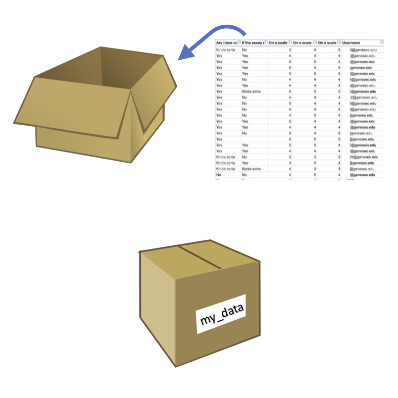
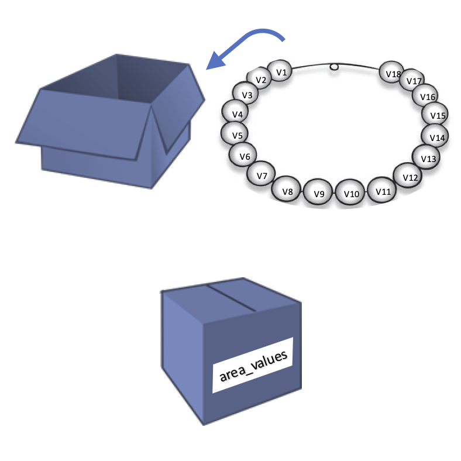

```{r setup, include=FALSE}
knitr::opts_chunk$set(echo = TRUE)
```


# Dataframes, vectors and numbers

## Dataframes

The usual data you will deal with are tabular (rows x columns) data, usually improperly called "Excel files".

The standard formats for raw data files in data analyses are *.csv*, *.tsv* and *.txt* files; these should be our starting point.

## Import file

The first thing to do is to import the file into R session. We can do it with several functions, but the standard one for *.csv* files is `read.csv`.

Let's see how to do so:

```{r, echo=TRUE}

```

#### Notes about variables

Variables are the "memory" of an R session, they represent box where R stores data/values you want.

You can think them as boxes that have a name on them:

<p align="center">
{width=400}
</p>

There are important **rules** about variables:

* In each variable you can store one single item (a number, a string, a dataframe, a list, ...)

* variable names can start only with a letter (uppercase or lowercase)

* variable names can contain **only** letters, numbers, underscores (_) and dots (.). **No spaces, no dash (-) or any other special characters**

* there could be only ONE variable with a specific name, saving an object with the same of another results in the substitution of the first one

* suggestion: variable names should be meaningful to you (and to the ones you share the code with): e.g. `x` is not a good name, while `patients_glucose_data` is preferred


### First steps on a dataframe

When importing a dataframe, there is a fundamental step to do: *inspection*. Inspection helps us to understand how the dataframe is structured, which type of data we have, which columns etc.

To do it, we use 3 functions that you need to remember (tatoo yourself): `summary`, `str` and `head`. Let's see them:

```{r}

```


```{r}

```

We can see how many rows and columns we have, as well as which columns, the data type of each and the first entries.

Lastly, `head` is the function that shows us the first 6 entries of the dataframe, as a table:


```{r}

```


## Vectors

Dataframes are organized and read by columns. Each column is a **vector** in R.

A vector is a collection of data of the __same type__; you can think of a vector as a pearl necklace, with each pearl being a single value:

<p align="center">
{width=400}
</p>

### Accessing dataframe columns

For exercise purposes, we can create a new variable storing the values of the area column of the dataframe. To extract a single column from a dataframe, we use the structure `dataframe_name$column_name`.

```{r, echo=TRUE}

```


<p align="center">
{width=400}
</p>

### Accessing values of a vector: slicing

**Slicing** is the operation of extract values out of a variable (in this case a vector). It is done to answer these questions:

* *Which is the first value of the vector?*

* *Which is the value at position n of a vector?*

* *Which are the values from position n to m?*

There are different ways in which we can slice a vector, and today we will see indexing (through positions).

The syntax is: 

* `variable_name[position]` to get one single value

* `variable_name[start:end]` to get elements from `start` to `end`

**REMEMBER**: In R, the first element is at index 1.

```{r}

```

```{r}

```

Q: *What 5:9 does in R?*
A: It creates a vector containing numbers from 5 to 9, that's why it works:
```{r}

```


Q: *And to get last element?* 

A: We need to know the lenght of the vector and use it as index. To get the length of a vector we use the function `length`:

```{r}

```


**Exercise**

Which is the 5th value of the intensity column of the dataframe? 


### Numbers in R

Now that we know how to get and extract numbers from numeric vectors, let's see what we can do with numbers in R.

#### Declare a new numeric variable

To declare a new numeric variable, we use the statement `variable_name <- number`:

```{r}

```

Decimal point numbers wants the dot `.` as decimal separator:

```{r}

```


#### Arithmetical operations

We can perform all sort of matematical operation:

```{r}

```


We can combine them all to do more complex operations. For example, you can resolve this equation $x^{2} - 7x + 12 = 0$. We know that the formula to resolve this equation is: $x = \frac{-b \pm \sqrt{b^{2} -4ac} }{2a}$, so we can reconstruct them in R:

```{r}

```


**Exercise**

Which are the last 3 values of the intensity column of the dataframe? 


### Vector-number operations

What we have seen so far on arithmetical operations between single numbers, can be applied also to numerical vector x single number operations.

In our data, area is expressed in µm^2 and we want to convert it into mm^2. To do so, we should divide each value of the area by a factor of 1,000,000; the cool thing about R is that this is done automatically when we use the statement `numeric_vector <operand> number`:

```{r}

```

This is true for ANY arithmetical operations:
```{r}

```

### Operations between vectors

It is possible also to perform element-wise operations between vectors. 

Let's load a new dataset with some patient data, and calculate the BMI of each patient.

```{r}

```

```{r}

```


```{r}

```

BMI formula: $\frac{\text{weight in kg}}{(\text{height in m})^2}$

To do so, we should transform the height in m, and then perform the operation. We will save the results as a **new column** of the dataframe; this can be done with the syntax `dataframe_variable$new_column_name <- vector` or `dataframe_variable$["new_column_name"] <- vector` (we will see on day 2 the strings).

```{r}


```


```{r}

```

### Sumamry statistics of numeric vectors

Usually, when dealing with numeric data we want to have some summary statistics on a specific data (e.g. mean values, median, quartile, standard deviation, ...).

In R there are many built-in functions that can help us in doing so:

* `mean` to calculate the mean

* `sd` to calculate the standard deviation

* `variance` to calculate the variance

* `median` to calculate the median

* `quantile` to calculate the nth quantile of a distribution

* `round` to round decimal values to n decimal places

* `sum` to sum all the values of the vector

* many others

They all have in common the syntax: `name_of_the_function(vector)`.

```{r}

```


**Exercise**

Scale BMI values (formula: $scaled_{i} = \frac{x_{i} - \overline{x}} {sd(x)}$)


## Save a dataframe

We are satisfied with this preliminary edit of the patients' data, so we can save the data to a dedicated file.


We use `write.csv` function:

```{r}

```


## Home exercise

For next time, if you want, you can try to do this exercise:

1. Starting from patient data (raw), load the file
2. Inspect it
3. You know that you have to give drug A to each patient so that the final concentration is 10 mg/kg (mg of drug every kg of patient). Calculate how much drug you should give to each patient.
4. Given that a single stock of drug A is 5 g, how many stocks you have to order?


## Bonus: how patient data were created

```{r}

```