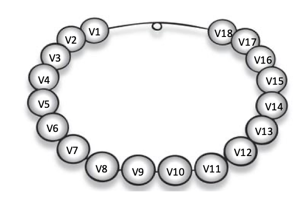
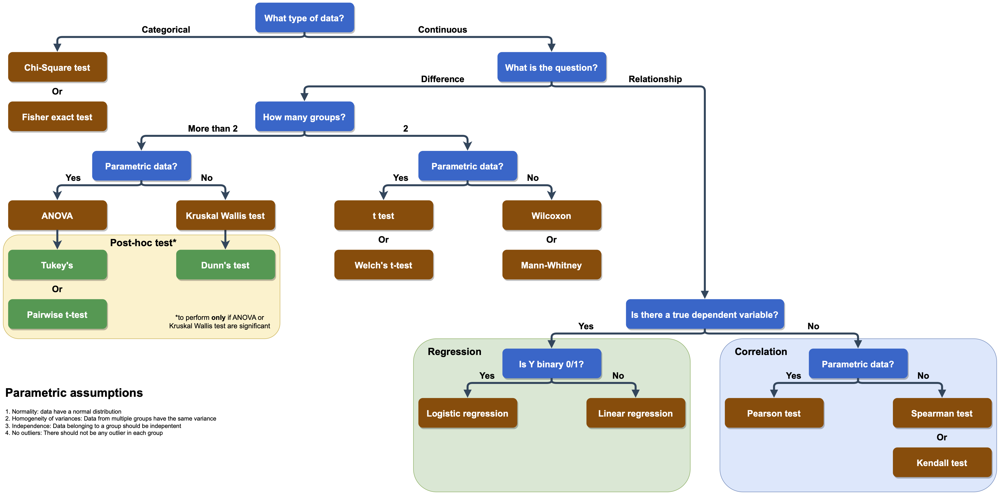

# Welcome

Welcome to this course, here you can find the notebooks used in the PhD
course of 2026.

Subscribe to receive notification when a new content is uploaded! NO
SPAM, just updates.

📬 Stay updated

Get notified when new material is published.

<form action="https://buttondown.com/api/emails/embed-subscribe/miotsdata" method="post" class="embeddable-buttondown-form" style="display: flex; flex-direction: column; gap: 0.7em;">

<input
type="email"
name="email"
id="bd-email"
placeholder="your@email.com"
style="
  padding: 0.6em 1em;
  border: 1px solid #ced4da;
  border-radius: 5px;
  font-size: 0.95em;
  outline: none;
  width: 100%;
  box-sizing: border-box;" />

<input
type="submit"
value="Subscribe"
style="
  padding: 0.6em 1em;
  background-color: #3873b8;
  color: white;
  border: none;
  border-radius: 5px;
  font-size: 0.95em;
  cursor: pointer;" />
</form>

<a href="https://buttondown.com/refer/miotsdata"
 target="_blank"
 style="color: #aaa; text-decoration: none;"> Powered by Buttondown </a>

<!--chapter:end:index.Rmd-->
<!-- Set working directory -->

# 1 Dataframes, vectors and numbers

## 1.1 Dataframes

The usual data you will deal with are tabular (rows x columns) data,
usually improperly called “Excel files”.

The standard formats for raw data files in data analyses are *.csv*,
*.tsv* and *.txt* files; these should be our starting point.

## 1.2 Import file

The first thing to do is to import the file into R session. We can do it
with several functions, but the standard one for *.csv* files is
`read.csv`.

Let’s see how to do so:

    my_data <- read.csv("data/input_df.csv")

#### 1.2.0.1 Notes about variables

Variables are the “memory” of an R session, they represent box where R
stores data/values you want.

You can think them as boxes that have a name on them:

There are important **rules** about variables:

-   In each variable you can store one single item (a number, a string,
    a dataframe, a list, …)

-   variable names can start only with a letter (uppercase or lowercase)

-   variable names can contain **only** letters, numbers, underscores
    (\_) and dots (.). **No spaces, no dash (-) or any other special
    characters**

-   there could be only ONE variable with a specific name, saving an
    object with the same of another results in the substitution of the
    first one

-   suggestion: variable names should be meaningful to you (and to the
    ones you share the code with): e.g. `x` is not a good name, while
    `patients_glucose_data` is preferred

<!-- Do examples in console -->

### 1.2.1 First steps on a dataframe

When importing a dataframe, there is a fundamental step to do:
*inspection*. Inspection helps us to understand how the dataframe is
structured, which type of data we have, which columns etc.

To do it, we use 3 functions that you need to remember (tatoo yourself):
`summary`, `str` and `head`. Let’s see them:

    summary(my_data)

         sample        timepoint           genotype          treatment        
     Min.   :  1.00   Length:192         Length:192         Length:192        
     1st Qu.: 48.75   Class :character   Class :character   Class :character  
     Median : 96.50   Mode  :character   Mode  :character   Mode  :character  
     Mean   : 96.50                                                           
     3rd Qu.:144.25                                                           
     Max.   :192.00                                                           
          area        intensity       
     Min.   :3000   Min.   : 9130286  
     1st Qu.:3259   1st Qu.:16283904  
     Median :3517   Median :18894103  
     Mean   :3508   Mean   :19419175  
     3rd Qu.:3769   3rd Qu.:22090201  
     Max.   :3988   Max.   :29812114  

    str(my_data)

    'data.frame':   192 obs. of  6 variables:
     $ sample   : int  1 2 3 4 5 6 7 8 9 10 ...
     $ timepoint: chr  "P1" "P1" "P1" "P1" ...
     $ genotype : chr  "wt" "wt" "wt" "wt" ...
     $ treatment: chr  "n" "n" "n" "n" ...
     $ area     : num  3125 3500 3773 3538 3936 ...
     $ intensity: num  16015465 19449815 21118210 18100075 20718554 ...

We can see how many rows and columns we have, as well as which columns,
the data type of each and the first entries.

Lastly, `head` is the function that shows us the first 6 entries of the
dataframe, as a table:

    head(my_data)

      sample timepoint genotype treatment     area intensity
    1      1        P1       wt         n 3124.709  16015465
    2      2        P1       wt         n 3499.559  19449815
    3      3        P1       wt         n 3773.000  21118210
    4      4        P1       wt         n 3538.320  18100075
    5      5        P1       wt         n 3936.014  20718554
    6      6        P1       wt         n 3646.389  19507110

## 1.3 Vectors

Dataframes are organized and read by columns. Each column is a
**vector** in R.

A vector is a collection of data of the **same type**; you can think of
a vector as a pearl necklace, with each pearl being a single value:

### 1.3.1 Accessing dataframe columns

For exercise purposes, we can create a new variable storing the values
of the area column of the dataframe. To extract a single column from a
dataframe, we use the structure `dataframe_name$column_name`.

    area_values <- my_data$area

### 1.3.2 Accessing values of a vector: slicing

**Slicing** is the operation of extract values out of a variable (in
this case a vector). It is done to answer these questions:

-   *Which is the first value of the vector?*

-   *Which is the value at position n of a vector?*

-   *Which are the values from position n to m?*

There are different ways in which we can slice a vector, and today we
will see indexing (through positions).

The syntax is:

-   `variable_name[position]` to get one single value

-   `variable_name[start:end]` to get elements from `start` to `end`

**REMEMBER**: In R, the first element is at index 1.

    # extract one single value

    first_area_value <- area_values[1]
    print(first_area_value)

    [1] 3124.709

    # extract range of values
    from_fifth_to_ninth_areas <- area_values[5:9]
    print(from_fifth_to_ninth_areas)

    [1] 3936.014 3646.389 3073.109 3717.063 3887.006

Q: *What 5:9 does in R?* A: It creates a vector containing numbers from
5 to 9, that’s why it works:

    print(5:9)

    [1] 5 6 7 8 9

Q: *And to get last element?*

A: We need to know the lenght of the vector and use it as index. To get
the length of a vector we use the function `length`:

    length_area <- length(area_values)
    print(length_area)

    [1] 192

    last_area <- area_values[length_area]
    print(last_area)

    [1] 3808.121

<!-- Why use a function and not hard code the value? -->

Which is the 5th value of the intensity column of the dataframe?

Solution

We can do it in many steps:

    intensity_values <- my_data$intensity

    fifth_intensity <- intensity_values[5]

    print(fifth_intensity)

    [1] 20718554

Or in just one step:

    fifth_intensity <- my_data$intensity[5]

    print(fifth_intensity)

    [1] 20718554

#### 1.3.2.1 Replace a value by index

We can replace of a vector using indexes.

**Note**: new values should be of the same type (numbers for numbers,
strings for strings ecc), otherwise everything will be changed to
strings (most of the time).

To change a single value, we can type
`variable_name[position] <- new_value`; to change multiple values
`variable_name[start:end] <- new_values`.

------------------------------------------------------------------------

### 1.3.3 Numbers in R

Now that we know how to get and extract numbers from numeric vectors,
let’s see what we can do with numbers in R.

#### 1.3.3.1 Declare a new numeric variable

To declare a new numeric variable, we use the statement
`variable_name <- number`:

    conversion_factor <- 1000

    print(conversion_factor)

    [1] 1000

    print(typeof(conversion_factor))

    [1] "double"

Decimal point numbers wants the dot `.` as decimal separator:

    decimal_n <- 215.6
    print(decimal_n)

    [1] 215.6

    print(typeof(decimal_n))

    [1] "double"

#### 1.3.3.2 Arithmetical operations

We can perform all sort of matematical operation:

    # sum

    print(2 + 5)

    [1] 7

    # subtraction

    print(7 - 2.5)

    [1] 4.5

    # multiplication
    print(12 * 5)

    [1] 60

    # division
    print(105 / 43)

    [1] 2.44186

    # exponential
    print(5 ** 2)

    [1] 25

    print(5 ^ 3)

    [1] 125

    # square root
    print(sqrt(12))

    [1] 3.464102

We can combine them all to do more complex operations. For example, you
can resolve this equation *x*2 − 7*x* + 12 = 0. We know that
the formula to resolve this equation is:
$x = \frac{-b \pm \sqrt{b^{2} -4ac} }{2a}$, so we can reconstruct them
in R:

    a <- 1
    b <- -7
    c <- 12

    x1 <- (-b + sqrt(b**2 - 4*a*c)) / (2 * a)
    x2 <- (-b - sqrt(b**2 - 4*a*c)) / (2 * a)

    print(x1)

    [1] 4

    print(x2)

    [1] 3

Which are the last 3 values of the intensity column of the dataframe?

Solution

We can do it in many steps:

    intensity_values <- my_data$intensity

    length_intensity <- length(intensity_values)

    third_to_last_index <- length_intensity - 2

    last_3_intensities <- intensity_values[third_to_last_index:length_intensity]

    print(last_3_intensities)

    [1] 22965783 22027811 22338574

### 1.3.4 Vector-number operations

What we have seen so far on arithmetical operations between single
numbers, can be applied also to numerical vector x single number
operations.

In our data, area is expressed in µm^2 and we want to convert it into
mm^2. To do so, we should divide each value of the area by a factor of
1,000,000; the cool thing about R is that this is done automatically
when we use the statement `numeric_vector <operand> number`:

    division_factor = 1e6

    areas_mm2 <- area_values / division_factor

    print(head(areas_mm2))

    [1] 0.003124709 0.003499559 0.003773000 0.003538320 0.003936014 0.003646389

    print(head(area_values))

    [1] 3124.709 3499.559 3773.000 3538.320 3936.014 3646.389

This is true for ANY arithmetical operations:

    print(head(intensity_values))

    [1] 16015465 19449815 21118210 18100075 20718554 19507110

    print(head(intensity_values + 10))

    [1] 16015475 19449825 21118220 18100085 20718564 19507120

### 1.3.5 Operations between vectors

It is possible also to perform element-wise operations between vectors.

Let’s load a new dataset with some patient data, and calculate the BMI
of each patient.

    patient_df <- read.csv("data/patient_data.csv")

    str(patient_df)

    'data.frame':   100 obs. of  3 variables:
     $ patient_id: int  1 2 3 4 5 6 7 8 9 10 ...
     $ weight    : num  75.8 61.8 91.7 66.4 80.4 ...
     $ height    : num  186 212 188 176 174 ...

    summary(patient_df)

       patient_id         weight           height      
     Min.   :  1.00   Min.   : 49.79   Min.   : 91.88  
     1st Qu.: 25.75   1st Qu.: 68.25   1st Qu.:159.20  
     Median : 50.50   Median : 73.91   Median :173.15  
     Mean   : 50.50   Mean   : 75.18   Mean   :174.96  
     3rd Qu.: 75.25   3rd Qu.: 84.61   3rd Qu.:185.90  
     Max.   :100.00   Max.   :112.18   Max.   :253.13  

    head(patient_df)

      patient_id   weight   height
    1          1 75.82265 185.6147
    2          2 61.77137 212.2587
    3          3 91.65377 188.3604
    4          4 66.38117 176.2986
    5          5 80.42689 174.0509
    6          6 79.32015 173.7906

BMI formula: $\frac{\text{weight in kg}}{(\text{height in m})^2}$

To do so, we should transform the height in m, and then perform the
operation. We will save the results as a **new column** of the
dataframe; this can be done with the syntax
`dataframe_variable$new_column_name <- vector` or
`dataframe_variable$["new_column_name"] <- vector` (we will see on day 2
the strings).

    # Get height in m
    patient_df$height_in_m <- patient_df$height / 100

    print(head(patient_df))

      patient_id   weight   height height_in_m
    1          1 75.82265 185.6147    1.856147
    2          2 61.77137 212.2587    2.122587
    3          3 91.65377 188.3604    1.883604
    4          4 66.38117 176.2986    1.762986
    5          5 80.42689 174.0509    1.740509
    6          6 79.32015 173.7906    1.737906

    patient_df["BMI"] <- patient_df$weight / (patient_df$height_in_m ** 2)

    print(head(patient_df))

      patient_id   weight   height height_in_m      BMI
    1          1 75.82265 185.6147    1.856147 22.00768
    2          2 61.77137 212.2587    2.122587 13.71059
    3          3 91.65377 188.3604    1.883604 25.83279
    4          4 66.38117 176.2986    1.762986 21.35733
    5          5 80.42689 174.0509    1.740509 26.54902
    6          6 79.32015 173.7906    1.737906 26.26220

### 1.3.6 Sumamry statistics of numeric vectors

Usually, when dealing with numeric data we want to have some summary
statistics on a specific data (e.g. mean values, median, quartile,
standard deviation, …).

In R there are many built-in functions that can help us in doing so:

-   `mean` to calculate the mean

-   `sd` to calculate the standard deviation

-   `variance` to calculate the variance

-   `median` to calculate the median

-   `quantile` to calculate the nth quantile of a distribution

-   `round` to round decimal values to n decimal places

-   `sum` to sum all the values of the vector

-   many others

They all have in common the syntax: `name_of_the_function(vector)`.

    intensity_mean <- mean(intensity_values)
    print(intensity_mean)

    [1] 19419175

    height_sd <- sd(patient_df$height)
    print(height_sd)

    [1] 26.73183

    BMI_median <- median(patient_df$BMI)
    print(BMI_median)

    [1] 25.23683

    first_quartile_weight <- quantile(patient_df$weight, probs = 0.25)
    print(first_quartile_weight)

         25% 
    68.25118 

    rounded_BMI <- round(patient_df$BMI, 1)
    print(head(rounded_BMI))

    [1] 22.0 13.7 25.8 21.4 26.5 26.3

Scale BMI values (formula:
$scaled\_{i} = \frac{x\_{i} - \overline{x}} {sd(x)}$)

Solution

Here is a step-by-step solution:

    # calculate BMI mean
    mean_BMI <- mean(patient_df$BMI)

    # calculate BMI sd
    sd_BMI <- sd(patient_df$BMI)

    # Calculate scaled BMIs
    patient_df$scaled_BMI <- (patient_df$BMI - mean_BMI) / sd_BMI

    print(head(patient_df))

      patient_id   weight   height height_in_m      BMI  scaled_BMI
    1          1 75.82265 185.6147    1.856147 22.00768 -0.44542706
    2          2 61.77137 212.2587    2.122587 13.71059 -1.29224320
    3          3 91.65377 188.3604    1.883604 25.83279 -0.05502959
    4          4 66.38117 176.2986    1.762986 21.35733 -0.51180319
    5          5 80.42689 174.0509    1.740509 26.54902  0.01807031
    6          6 79.32015 173.7906    1.737906 26.26220 -0.01120341

That is exactly what the formula `scale` do underneath:

    # Calculate scaled BMIs
    patient_df$scaled_BMI_function <- scale(patient_df$BMI)

    print(head(patient_df))

      patient_id   weight   height height_in_m      BMI  scaled_BMI
    1          1 75.82265 185.6147    1.856147 22.00768 -0.44542706
    2          2 61.77137 212.2587    2.122587 13.71059 -1.29224320
    3          3 91.65377 188.3604    1.883604 25.83279 -0.05502959
    4          4 66.38117 176.2986    1.762986 21.35733 -0.51180319
    5          5 80.42689 174.0509    1.740509 26.54902  0.01807031
    6          6 79.32015 173.7906    1.737906 26.26220 -0.01120341
      scaled_BMI_function
    1         -0.44542706
    2         -1.29224320
    3         -0.05502959
    4         -0.51180319
    5          0.01807031
    6         -0.01120341

## 1.4 Save a dataframe

We are satisfied with this preliminary edit of the patients’ data, so we
can save the data to a dedicated file.

<!-- Explain importance of new files + create new folder from Files tab-->

We use `write.csv` function:

    write.csv(patient_df, # what we want to save
              file = "output/patients_data_BMI.csv", # name of the file
              row.names = FALSE) # we'll see row names in day 2

<!-- Install tidyverse -->

## 1.5 Home exercise

For next time, if you want, you can try to do this exercise:

1.  Starting from patient data (raw), load the file
2.  Inspect it
3.  You know that you have to give drug A to each patient so that the
    final concentration is 10 mg/kg (mg of drug every kg of patient).
    Calculate how much drug you should give to each patient.
4.  Given that a single stock of drug A is 5 g, how many stocks you have
    to order?

Solution

    # 1. Load the file
    patient_df <- read.csv("data/patient_data.csv")

    # 2. Inspect it
    head(patient_df)

      patient_id   weight   height
    1          1 75.82265 185.6147
    2          2 61.77137 212.2587
    3          3 91.65377 188.3604
    4          4 66.38117 176.2986
    5          5 80.42689 174.0509
    6          6 79.32015 173.7906

    str(patient_df)

    'data.frame':   100 obs. of  3 variables:
     $ patient_id: int  1 2 3 4 5 6 7 8 9 10 ...
     $ weight    : num  75.8 61.8 91.7 66.4 80.4 ...
     $ height    : num  186 212 188 176 174 ...

    summary(patient_df)

       patient_id         weight           height      
     Min.   :  1.00   Min.   : 49.79   Min.   : 91.88  
     1st Qu.: 25.75   1st Qu.: 68.25   1st Qu.:159.20  
     Median : 50.50   Median : 73.91   Median :173.15  
     Mean   : 50.50   Mean   : 75.18   Mean   :174.96  
     3rd Qu.: 75.25   3rd Qu.: 84.61   3rd Qu.:185.90  
     Max.   :100.00   Max.   :112.18   Max.   :253.13  

    # 3. Calculate drug for each patient

    patient_df$drugA_quantity_mg <- patient_df$weight * 10
    head(patient_df)

      patient_id   weight   height drugA_quantity_mg
    1          1 75.82265 185.6147          758.2265
    2          2 61.77137 212.2587          617.7137
    3          3 91.65377 188.3604          916.5377
    4          4 66.38117 176.2986          663.8117
    5          5 80.42689 174.0509          804.2689
    6          6 79.32015 173.7906          793.2015

    # 4. How many stocks you have to order?

    total_drug_A_mg <- sum(patient_df$drugA_quantity_mg)

    total_drug_A_g <- total_drug_A_mg / 1000

    stock_weight <- 5

    number_of_stocks <- total_drug_A_g/stock_weight

    print(number_of_stocks)

    [1] 15.03539

To be precise, we can use `ceiling` function that round to the upper
integer:

    number_of_stocks <- ceiling(number_of_stocks)

    print(number_of_stocks)

    [1] 16

<!--chapter:end:01-Dataframes_vectors_numbers_complete.Rmd-->
<!-- Set working directory -->

# 2 Strings, Factors and Dataframe Handling

## 2.1 What we will see today

Today we will look at some patient data, and we will answer these
questions:

-   Are data consistent?

-   Which is the mean and sd values of glucose in each treatment group?
    How many patients we have per treatment group?

-   Which group has the highest mean creatinine? (2 different datasets)

## 2.2 Strings and Factors

Today we will work with a clinical dataset containing information about
patients enrolled in a multi-site trial. Let’s import it and, as always,
**inspect it first**:

    library(tidyverse)

    ── Attaching core tidyverse packages ──────────────────────── tidyverse 2.0.0 ──
    ✔ dplyr     1.2.1     ✔ readr     2.2.0
    ✔ forcats   1.0.1     ✔ stringr   1.6.0
    ✔ ggplot2   4.0.3     ✔ tibble    3.3.1
    ✔ lubridate 1.9.5     ✔ tidyr     1.3.2
    ✔ purrr     1.2.2     
    ── Conflicts ────────────────────────────────────────── tidyverse_conflicts() ──
    ✖ dplyr::filter() masks stats::filter()
    ✖ dplyr::lag()    masks stats::lag()
    ℹ Use the conflicted package (<http://conflicted.r-lib.org/>) to force all conflicts to become errors

    clinical_data <- read.csv("data/clinical_data.csv")

    str(clinical_data)

    'data.frame':   240 obs. of  15 variables:
     $ patient_id      : chr  "PT-001" "PT-002" "PT-003" "PT-004" ...
     $ site            : chr  "Milan" "Rome" "Rome" "Turin " ...
     $ visit_date      : chr  "2023-07-20" "2020-08-15" "2023-10-15" "2020-03-06" ...
     $ age             : int  40 40 59 46 58 53 51 34 43 60 ...
     $ sex             : chr  "Male" "Male" "Female" "Male" ...
     $ smoking         : chr  "never" "Curent" "former" "Curent" ...
     $ treatment       : chr  "Drug_A" "Drug_B" "Drug_A" "Drug_A" ...
     $ stage           : chr  "II" "I" "I" "I" ...
     $ weight_kg       : num  85.9 100.9 65 95.9 75.7 ...
     $ height_cm       : num  173 185 166 182 168 ...
     $ sbp_mmhg        : int  164 143 152 142 160 150 137 146 151 159 ...
     $ dbp_mmhg        : int  101 102 98 88 96 107 96 106 94 104 ...
     $ glucose_mgdl    : int  113 105 110 120 131 78 108 93 106 110 ...
     $ cholesterol_mgdl: int  172 239 146 232 192 232 163 199 200 185 ...
     $ crp_ngml        : num  5.89 6.13 7.81 3.35 21.72 ...

    summary(clinical_data)

      patient_id            site            visit_date             age      
     Length:240         Length:240         Length:240         Min.   :26.0  
     Class :character   Class :character   Class :character   1st Qu.:49.0  
     Mode  :character   Mode  :character   Mode  :character   Median :57.5  
                                                              Mean   :57.3  
                                                              3rd Qu.:65.0  
                                                              Max.   :85.0  
         sex              smoking           treatment            stage          
     Length:240         Length:240         Length:240         Length:240        
     Class :character   Class :character   Class :character   Class :character  
     Mode  :character   Mode  :character   Mode  :character   Mode  :character  
                                                                                
                                                                                
                                                                                
       weight_kg        height_cm        sbp_mmhg        dbp_mmhg     
     Min.   : 39.40   Min.   :148.9   Min.   :115.0   Min.   : 73.00  
     1st Qu.: 65.35   1st Qu.:162.2   1st Qu.:139.0   1st Qu.: 90.75  
     Median : 75.65   Median :168.5   Median :146.5   Median : 97.00  
     Mean   : 76.87   Mean   :169.2   Mean   :146.7   Mean   : 96.11  
     3rd Qu.: 87.83   3rd Qu.:174.8   3rd Qu.:153.2   3rd Qu.:102.00  
     Max.   :132.90   Max.   :200.1   Max.   :192.0   Max.   :120.00  
      glucose_mgdl   cholesterol_mgdl    crp_ngml    
     Min.   : 60.0   Min.   :113.0    Min.   : 1.92  
     1st Qu.: 98.0   1st Qu.:189.8    1st Qu.: 5.30  
     Median :109.0   Median :207.0    Median : 8.37  
     Mean   :108.8   Mean   :207.9    Mean   :10.35  
     3rd Qu.:118.0   3rd Qu.:226.0    3rd Qu.:13.02  
     Max.   :149.0   Max.   :307.0    Max.   :42.09  

    head(clinical_data)

      patient_id   site visit_date age    sex smoking treatment stage weight_kg
    1     PT-001  Milan 2023-07-20  40   Male   never    Drug_A    II      85.9
    2     PT-002   Rome 2020-08-15  40   Male  Curent    Drug_B     I     100.9
    3     PT-003   Rome 2023-10-15  59 Female  former    Drug_A     I      65.0
    4     PT-004 Turin  2020-03-06  46   Male  Curent    Drug_A     I      95.9
    5     PT-005  Turin 2023-03-30  58   Male  FORMER    Drug_B   III      75.7
    6     PT-006  Milan 2023-04-15  53 Female  Curent   Control    IV      69.6
      height_cm sbp_mmhg dbp_mmhg glucose_mgdl cholesterol_mgdl crp_ngml
    1     172.7      164      101          113              172     5.89
    2     185.3      143      102          105              239     6.13
    3     165.6      152       98          110              146     7.81
    4     181.5      142       88          120              232     3.35
    5     168.1      160       96          131              192    21.72
    6     174.3      150      107           78              232    32.42

You will notice that several columns contain text: `patient_id`, `sex`,
`treatment`, `stage`, `smoking`, `site`, `diagnosis_code`. In R, text
data can be represented in two fundamentally different ways: as
**strings** (also called *characters*) or as **factors**. Let’s
understand the difference.

------------------------------------------------------------------------

A **string** (or character) is simply a sequence of text. R treats it as
a raw piece of text and does not impose any structure on it.

A **factor** is a *categorical variable*: it has a fixed, predefined set
of allowed values called **levels**. Under the hood, R stores factors as
integers (one integer per level) and keeps a table that maps integers to
labels. This makes factors memory-efficient and very useful for
statistical modelling (e.g., in regression, factors are automatically
handled as categorical predictors) and for plotting purposes.

**When to use strings and when factors?**

<table>
<colgroup>
<col style="width: 50%" />
<col style="width: 50%" />
</colgroup>
<thead>
<tr class="header">
<th>Use <strong>string</strong> when…</th>
<th>Use <strong>factor</strong> when…</th>
</tr>
</thead>
<tbody>
<tr class="odd">
<td>Text is free-form or unpredictable</td>
<td>The variable takes a limited set of known values</td>
</tr>
<tr class="even">
<td>You need to manipulate the text</td>
<td>Order matters (e.g., stage I &lt; II &lt; III &lt; IV)</td>
</tr>
<tr class="odd">
<td>Unique identifiers (patient IDs)</td>
<td>Input to statistical models</td>
</tr>
</tbody>
</table>

As some of our columns fall in the conditions for factors, let’s convert
them with the function `factor`:

    clinical_data$sex       <- factor(clinical_data$sex)
    clinical_data$treatment <- factor(clinical_data$treatment)
    clinical_data$site      <- factor(clinical_data$site)
    clinical_data$smoking   <- factor(clinical_data$smoking)

    # For stage, the categories have a natural ORDER: we declare an ordered factor
    clinical_data$stage <- factor(clinical_data$stage,
                                   levels = c("I", "II", "III", "IV"),
                                   ordered = TRUE)

    str(clinical_data)

    'data.frame':   240 obs. of  15 variables:
     $ patient_id      : chr  "PT-001" "PT-002" "PT-003" "PT-004" ...
     $ site            : Factor w/ 4 levels "Milan","Rome",..: 1 2 2 4 3 1 2 2 1 2 ...
     $ visit_date      : chr  "2023-07-20" "2020-08-15" "2023-10-15" "2020-03-06" ...
     $ age             : int  40 40 59 46 58 53 51 34 43 60 ...
     $ sex             : Factor w/ 2 levels "Female","Male": 2 2 1 2 2 1 2 1 2 2 ...
     $ smoking         : Factor w/ 7 levels "Curent","current",..: 5 1 3 1 4 1 3 6 5 4 ...
     $ treatment       : Factor w/ 3 levels "Control","Drug_A",..: 2 3 2 2 3 1 2 1 3 2 ...
     $ stage           : Ord.factor w/ 4 levels "I"<"II"<"III"<..: 2 1 1 1 3 4 1 1 3 2 ...
     $ weight_kg       : num  85.9 100.9 65 95.9 75.7 ...
     $ height_cm       : num  173 185 166 182 168 ...
     $ sbp_mmhg        : int  164 143 152 142 160 150 137 146 151 159 ...
     $ dbp_mmhg        : int  101 102 98 88 96 107 96 106 94 104 ...
     $ glucose_mgdl    : int  113 105 110 120 131 78 108 93 106 110 ...
     $ cholesterol_mgdl: int  172 239 146 232 192 232 163 199 200 185 ...
     $ crp_ngml        : num  5.89 6.13 7.81 3.35 21.72 ...

Now `summary` gives us much more useful information on those columns:

    summary(clinical_data)

      patient_id            site     visit_date             age           sex     
     Length:240         Milan :96   Length:240         Min.   :26.0   Female:118  
     Class :character   Rome  :77   Class :character   1st Qu.:49.0   Male  :122  
     Mode  :character   Turin :31   Mode  :character   Median :57.5               
                        Turin :36                      Mean   :57.3               
                                                       3rd Qu.:65.0               
                                                       Max.   :85.0               
                                                                                  
             smoking     treatment  stage      weight_kg        height_cm    
     Curent      :35   Control:74   I  :76   Min.   : 39.40   Min.   :148.9  
     current     :28   Drug_A :88   II :73   1st Qu.: 65.35   1st Qu.:162.2  
     former      :44   Drug_B :78   III:53   Median : 75.65   Median :168.5  
     FORMER      :46                IV :38   Mean   : 76.87   Mean   :169.2  
     never       :26                         3rd Qu.: 87.83   3rd Qu.:174.8  
     Never       :28                         Max.   :132.90   Max.   :200.1  
     never smoker:33                                                         
        sbp_mmhg        dbp_mmhg       glucose_mgdl   cholesterol_mgdl
     Min.   :115.0   Min.   : 73.00   Min.   : 60.0   Min.   :113.0   
     1st Qu.:139.0   1st Qu.: 90.75   1st Qu.: 98.0   1st Qu.:189.8   
     Median :146.5   Median : 97.00   Median :109.0   Median :207.0   
     Mean   :146.7   Mean   : 96.11   Mean   :108.8   Mean   :207.9   
     3rd Qu.:153.2   3rd Qu.:102.00   3rd Qu.:118.0   3rd Qu.:226.0   
     Max.   :192.0   Max.   :120.00   Max.   :149.0   Max.   :307.0   
                                                                      
        crp_ngml    
     Min.   : 1.92  
     1st Qu.: 5.30  
     Median : 8.37  
     Mean   :10.35  
     3rd Qu.:13.02  
     Max.   :42.09  
                    

Notice how `summary` now shows the count per level for factors (e.g. how
many Male vs Female), while before it just said `character`.

Moreover, we can see that in smoking column, we have different labels
with the same meaning (never, Never, never smoker for never). R (as well
as any programming language) is case sensitive, so it treats those 3 as
different labels, even if for us they mean the same thing.

**IMPORTANT**: labels should be consistent across datasets when you fill
them.

As we want to edit those to be consistent, we need to change the column
back to be a character, with `as.character` function:

    clinical_data$smoking   <- as.character(clinical_data$smoking)
    str(clinical_data)

    'data.frame':   240 obs. of  15 variables:
     $ patient_id      : chr  "PT-001" "PT-002" "PT-003" "PT-004" ...
     $ site            : Factor w/ 4 levels "Milan","Rome",..: 1 2 2 4 3 1 2 2 1 2 ...
     $ visit_date      : chr  "2023-07-20" "2020-08-15" "2023-10-15" "2020-03-06" ...
     $ age             : int  40 40 59 46 58 53 51 34 43 60 ...
     $ sex             : Factor w/ 2 levels "Female","Male": 2 2 1 2 2 1 2 1 2 2 ...
     $ smoking         : chr  "never" "Curent" "former" "Curent" ...
     $ treatment       : Factor w/ 3 levels "Control","Drug_A",..: 2 3 2 2 3 1 2 1 3 2 ...
     $ stage           : Ord.factor w/ 4 levels "I"<"II"<"III"<..: 2 1 1 1 3 4 1 1 3 2 ...
     $ weight_kg       : num  85.9 100.9 65 95.9 75.7 ...
     $ height_cm       : num  173 185 166 182 168 ...
     $ sbp_mmhg        : int  164 143 152 142 160 150 137 146 151 159 ...
     $ dbp_mmhg        : int  101 102 98 88 96 107 96 106 94 104 ...
     $ glucose_mgdl    : int  113 105 110 120 131 78 108 93 106 110 ...
     $ cholesterol_mgdl: int  172 239 146 232 192 232 163 199 200 185 ...
     $ crp_ngml        : num  5.89 6.13 7.81 3.35 21.72 ...

We can now proceed.

### 2.2.1 Operations on strings

The main package for string operations in R (and the one we will use
throughout the course) is `stringr`, which is part of the `tidyverse`.
All its functions start with `str_` to make them easy to remember.

#### 2.2.1.1 Character substitution

Let’s start by looking at how to change characters in a string: from
“Curent” to “current” using
`str_replace(vector, old_pattern, new_pattern)`.

    print(unique(clinical_data$smoking))

    [1] "never"        "Curent"       "former"       "FORMER"       "Never"       
    [6] "never smoker" "current"     

    clinical_data$smoking <- str_replace(clinical_data$smoking, "Curent", "current")
    print(unique(clinical_data$smoking))

    [1] "never"        "current"      "former"       "FORMER"       "Never"       
    [6] "never smoker"

Then we can unify “FORMER” and “former” by transforming the former to
lowercase with `str_to_lower`:

    print(unique(clinical_data$smoking))

    [1] "never"        "current"      "former"       "FORMER"       "Never"       
    [6] "never smoker"

    clinical_data$smoking <- str_to_lower(clinical_data$smoking)
    print(unique(clinical_data$smoking))

    [1] "never"        "current"      "former"       "never smoker"

We have converted both FORMER to former and Never to never. We lastly
have to change “never smoker” to “never”.

Change “never smoker” to “smoker” and make smoker as factor.

Solution

    clinical_data$smoking <- str_replace(clinical_data$smoking, "never smoker", "never")
    clinical_data$smoking <- factor(clinical_data$smoking, levels = c("never", "former", "current"))

    summary(clinical_data)

      patient_id            site     visit_date             age           sex     
     Length:240         Milan :96   Length:240         Min.   :26.0   Female:118  
     Class :character   Rome  :77   Class :character   1st Qu.:49.0   Male  :122  
     Mode  :character   Turin :31   Mode  :character   Median :57.5               
                        Turin :36                      Mean   :57.3               
                                                       3rd Qu.:65.0               
                                                       Max.   :85.0               
        smoking     treatment  stage      weight_kg        height_cm    
     never  :87   Control:74   I  :76   Min.   : 39.40   Min.   :148.9  
     former :90   Drug_A :88   II :73   1st Qu.: 65.35   1st Qu.:162.2  
     current:63   Drug_B :78   III:53   Median : 75.65   Median :168.5  
                               IV :38   Mean   : 76.87   Mean   :169.2  
                                        3rd Qu.: 87.83   3rd Qu.:174.8  
                                        Max.   :132.90   Max.   :200.1  
        sbp_mmhg        dbp_mmhg       glucose_mgdl   cholesterol_mgdl
     Min.   :115.0   Min.   : 73.00   Min.   : 60.0   Min.   :113.0   
     1st Qu.:139.0   1st Qu.: 90.75   1st Qu.: 98.0   1st Qu.:189.8   
     Median :146.5   Median : 97.00   Median :109.0   Median :207.0   
     Mean   :146.7   Mean   : 96.11   Mean   :108.8   Mean   :207.9   
     3rd Qu.:153.2   3rd Qu.:102.00   3rd Qu.:118.0   3rd Qu.:226.0   
     Max.   :192.0   Max.   :120.00   Max.   :149.0   Max.   :307.0   
        crp_ngml    
     Min.   : 1.92  
     1st Qu.: 5.30  
     Median : 8.37  
     Mean   :10.35  
     3rd Qu.:13.02  
     Max.   :42.09  

For sake of completeness, we could have done all of this with a single
function `replace_values` (for new versions of R):

    clinical_data$smoking <- replace_values(as.character(clinical_data$smoking), c("never smoker", "Never") ~ "never",
                                            c("Curent") ~ "current",
                                            c("FORMER") ~ "former")

    clinical_data$smoking = factor(clinical_data$smoking)

If it doesn’t work, you could use:

    clinical_data = mutate(smoking = case_when(
        smoking %in% c("never smoker", "Never") ~ "never",
        smoking %in% c("FORMER", "Former", "Fomer") ~ "former",
        smoking == "Curent" ~ "current",
        .default = smoking),
        .data = clinical_data
        )

    clinical_data$smoking = factor(clinical_data$smoking)

Q: *Why there are 2 Turin?* A: Let’s check in details the possible
labels of that column with function `levels`:

    print(levels(clinical_data$site))

    [1] "Milan"  "Rome"   "Turin"  "Turin "

Here’s the hitch, some have a trailing space after Turin. We can get rid
of them using `str_trim` function:

    print(levels(clinical_data$site))

    [1] "Milan"  "Rome"   "Turin"  "Turin "

    clinical_data$site <- factor(str_trim(clinical_data$site))

    print(levels(clinical_data$site))

    [1] "Milan" "Rome"  "Turin"

    print(summary(clinical_data))

      patient_id           site     visit_date             age           sex     
     Length:240         Milan:96   Length:240         Min.   :26.0   Female:118  
     Class :character   Rome :77   Class :character   1st Qu.:49.0   Male  :122  
     Mode  :character   Turin:67   Mode  :character   Median :57.5               
                                                      Mean   :57.3               
                                                      3rd Qu.:65.0               
                                                      Max.   :85.0               
        smoking     treatment  stage      weight_kg        height_cm    
     current:63   Control:74   I  :76   Min.   : 39.40   Min.   :148.9  
     former :90   Drug_A :88   II :73   1st Qu.: 65.35   1st Qu.:162.2  
     never  :87   Drug_B :78   III:53   Median : 75.65   Median :168.5  
                               IV :38   Mean   : 76.87   Mean   :169.2  
                                        3rd Qu.: 87.83   3rd Qu.:174.8  
                                        Max.   :132.90   Max.   :200.1  
        sbp_mmhg        dbp_mmhg       glucose_mgdl   cholesterol_mgdl
     Min.   :115.0   Min.   : 73.00   Min.   : 60.0   Min.   :113.0   
     1st Qu.:139.0   1st Qu.: 90.75   1st Qu.: 98.0   1st Qu.:189.8   
     Median :146.5   Median : 97.00   Median :109.0   Median :207.0   
     Mean   :146.7   Mean   : 96.11   Mean   :108.8   Mean   :207.9   
     3rd Qu.:153.2   3rd Qu.:102.00   3rd Qu.:118.0   3rd Qu.:226.0   
     Max.   :192.0   Max.   :120.00   Max.   :149.0   Max.   :307.0   
        crp_ngml    
     Min.   : 1.92  
     1st Qu.: 5.30  
     Median : 8.37  
     Mean   :10.35  
     3rd Qu.:13.02  
     Max.   :42.09  

#### 2.2.1.2 Other useful functions to handle strings

A few more `stringr` functions you will find very useful:

<table>
<colgroup>
<col style="width: 50%" />
<col style="width: 50%" />
</colgroup>
<thead>
<tr class="header">
<th>Function</th>
<th>What it does</th>
</tr>
</thead>
<tbody>
<tr class="odd">
<td><code>str_detect(x, pattern)</code></td>
<td>Returns TRUE/FALSE: does the string contain the pattern?</td>
</tr>
<tr class="even">
<td><code>str_starts(x, pattern)</code></td>
<td>Does the string <em>start</em> with the pattern?</td>
</tr>
<tr class="odd">
<td><code>str_ends(x, pattern)</code></td>
<td>Does the string <em>end</em> with the pattern?</td>
</tr>
<tr class="even">
<td><code>str_pad(x, width, side, pad)</code></td>
<td>Pads a string to a given width</td>
</tr>
<tr class="odd">
<td><code>str_sub(x, start, end)</code></td>
<td>Extracts a substring by position</td>
</tr>
</tbody>
</table>

------------------------------------------------------------------------

### 2.2.2 Operations on multiple columns

#### 2.2.2.1 Split a column and merge multiple columns

Sometimes a single column contains multiple pieces of information that
could be split into separate columns. Look at `visit_date`:

    head(clinical_data$visit_date)

    [1] "2023-07-20" "2020-08-15" "2023-10-15" "2020-03-06" "2023-03-30"
    [6] "2023-04-15"

We can see that the year of visit varies a lot, maybe we should take it
into account. We can split this into 3 separate columns using `separate`
function:

    clinical_data <- separate(clinical_data,
                               col = visit_date,         # column to split
                               into = c("visit_year", "visit_month", "visit_day"), # new column names
                               sep = "-",                # separator
                               remove = FALSE)           # keep the original column

    head(clinical_data)

      patient_id  site visit_date visit_year visit_month visit_day age    sex
    1     PT-001 Milan 2023-07-20       2023          07        20  40   Male
    2     PT-002  Rome 2020-08-15       2020          08        15  40   Male
    3     PT-003  Rome 2023-10-15       2023          10        15  59 Female
    4     PT-004 Turin 2020-03-06       2020          03        06  46   Male
    5     PT-005 Turin 2023-03-30       2023          03        30  58   Male
    6     PT-006 Milan 2023-04-15       2023          04        15  53 Female
      smoking treatment stage weight_kg height_cm sbp_mmhg dbp_mmhg glucose_mgdl
    1   never    Drug_A    II      85.9     172.7      164      101          113
    2 current    Drug_B     I     100.9     185.3      143      102          105
    3  former    Drug_A     I      65.0     165.6      152       98          110
    4 current    Drug_A     I      95.9     181.5      142       88          120
    5  former    Drug_B   III      75.7     168.1      160       96          131
    6 current   Control    IV      69.6     174.3      150      107           78
      cholesterol_mgdl crp_ngml
    1              172     5.89
    2              239     6.13
    3              146     7.81
    4              232     3.35
    5              192    21.72
    6              232    32.42

The opposite operation — merging multiple columns into one — is done
with `unite`:

    # example: unite back together
    clinical_data <- unite(clinical_data,
                           col = "visit_year_month",         # name of the new column
                           visit_year, visit_month,           # columns to merge
                           sep = "-",                      # separator
                           remove = FALSE)                 # keep original columns

    head(clinical_data)

      patient_id  site visit_date visit_year_month visit_year visit_month visit_day
    1     PT-001 Milan 2023-07-20          2023-07       2023          07        20
    2     PT-002  Rome 2020-08-15          2020-08       2020          08        15
    3     PT-003  Rome 2023-10-15          2023-10       2023          10        15
    4     PT-004 Turin 2020-03-06          2020-03       2020          03        06
    5     PT-005 Turin 2023-03-30          2023-03       2023          03        30
    6     PT-006 Milan 2023-04-15          2023-04       2023          04        15
      age    sex smoking treatment stage weight_kg height_cm sbp_mmhg dbp_mmhg
    1  40   Male   never    Drug_A    II      85.9     172.7      164      101
    2  40   Male current    Drug_B     I     100.9     185.3      143      102
    3  59 Female  former    Drug_A     I      65.0     165.6      152       98
    4  46   Male current    Drug_A     I      95.9     181.5      142       88
    5  58   Male  former    Drug_B   III      75.7     168.1      160       96
    6  53 Female current   Control    IV      69.6     174.3      150      107
      glucose_mgdl cholesterol_mgdl crp_ngml
    1          113              172     5.89
    2          105              239     6.13
    3          110              146     7.81
    4          120              232     3.35
    5          131              192    21.72
    6           78              232    32.42

------------------------------------------------------------------------

### 2.2.3 Column and row names

Every dataframe has **column names** (the variable names) and **row
names** (by default a number, but we can change it).

To retrieve column names:

    colnames(clinical_data)

     [1] "patient_id"       "site"             "visit_date"       "visit_year_month"
     [5] "visit_year"       "visit_month"      "visit_day"        "age"             
     [9] "sex"              "smoking"          "treatment"        "stage"           
    [13] "weight_kg"        "height_cm"        "sbp_mmhg"         "dbp_mmhg"        
    [17] "glucose_mgdl"     "cholesterol_mgdl" "crp_ngml"        

To rename specific columns, we can assign a new vector of names to
`colnames`, or use the tidyverse function `rename` (we will see this
with `dplyr` below):

    clinical_data = rename(clinical_data, "diastolic_bp_mmhg" = "dbp_mmhg", "systolic_bp_mmhg" = "sbp_mmhg")

    colnames(clinical_data)

     [1] "patient_id"        "site"              "visit_date"       
     [4] "visit_year_month"  "visit_year"        "visit_month"      
     [7] "visit_day"         "age"               "sex"              
    [10] "smoking"           "treatment"         "stage"            
    [13] "weight_kg"         "height_cm"         "systolic_bp_mmhg" 
    [16] "diastolic_bp_mmhg" "glucose_mgdl"      "cholesterol_mgdl" 
    [19] "crp_ngml"         

For row names:

    # by default, row names are row numbers
    head(rownames(clinical_data))

    [1] "1" "2" "3" "4" "5" "6"

    # we could set patient_id as row names
    rownames(clinical_data) <- clinical_data$patient_id

    head(rownames(clinical_data))

    [1] "PT-001" "PT-002" "PT-003" "PT-004" "PT-005" "PT-006"

However, **be careful** with row names: they are not a proper column of
the dataframe, so they don’t follow along easily in many tidyverse
operations. It is generally better to keep your identifiers as a regular
column.

------------------------------------------------------------------------

## 2.3 Dataframe Handling

The main verbs we will learn today are:

-   `mutate` — add or modify columns
-   `select` — choose which columns to keep
-   `filter`/`filter_out` — keep/remove rows that satisfy a condition
-   `group_by` + `summarize` / `reframe` — aggregate data by groups
-   `left_join` / `inner_join` — merge two dataframes

### 2.3.1 Create new columns with mutate

`mutate` creates new columns or modifies existing ones.

A key feature of `dplyr` is the **pipe operator** `|>` (or `%>%` in
older tidyverse style). It passes the result of one operation directly
to the next, making code much more readable:

You can read `|>` as *“and then”*.

    # Add a BMI column (we already know this formula!)
    clinical_data <- clinical_data |> # take clinical_data and then
      mutate(height_m = height_cm / 100,
             BMI = weight_kg / height_m^2,
             BMI = round(BMI, 1))

    head(clinical_data)

           patient_id  site visit_date visit_year_month visit_year visit_month
    PT-001     PT-001 Milan 2023-07-20          2023-07       2023          07
    PT-002     PT-002  Rome 2020-08-15          2020-08       2020          08
    PT-003     PT-003  Rome 2023-10-15          2023-10       2023          10
    PT-004     PT-004 Turin 2020-03-06          2020-03       2020          03
    PT-005     PT-005 Turin 2023-03-30          2023-03       2023          03
    PT-006     PT-006 Milan 2023-04-15          2023-04       2023          04
           visit_day age    sex smoking treatment stage weight_kg height_cm
    PT-001        20  40   Male   never    Drug_A    II      85.9     172.7
    PT-002        15  40   Male current    Drug_B     I     100.9     185.3
    PT-003        15  59 Female  former    Drug_A     I      65.0     165.6
    PT-004        06  46   Male current    Drug_A     I      95.9     181.5
    PT-005        30  58   Male  former    Drug_B   III      75.7     168.1
    PT-006        15  53 Female current   Control    IV      69.6     174.3
           systolic_bp_mmhg diastolic_bp_mmhg glucose_mgdl cholesterol_mgdl
    PT-001              164               101          113              172
    PT-002              143               102          105              239
    PT-003              152                98          110              146
    PT-004              142                88          120              232
    PT-005              160                96          131              192
    PT-006              150               107           78              232
           crp_ngml height_m  BMI
    PT-001     5.89    1.727 28.8
    PT-002     6.13    1.853 29.4
    PT-003     7.81    1.656 23.7
    PT-004     3.35    1.815 29.1
    PT-005    21.72    1.681 26.8
    PT-006    32.42    1.743 22.9

`mutate` can also create columns based on conditions, using `if_else` or
`case_when`:

    # Classify BMI into categories
    clinical_data <- clinical_data |>
      mutate(BMI_class = case_when(
        BMI < 18.5 ~ "Underweight",
        BMI < 25   ~ "Normal",
        BMI < 30   ~ "Overweight",
        BMI >= 30  ~ "Obese"
      ),
      BMI_class = factor(BMI_class, labels = c("Underweight", "Normal", "Overweight", "Obese"), ordered = T)
      )

    summary(clinical_data$BMI_class)

    Underweight      Normal  Overweight       Obese 
             67          58         102          13 

------------------------------------------------------------------------

### 2.3.2 select

`select` chooses which **columns** to keep (or drop). This is useful
when working with wide dataframes where you only need a subset of
variables.

    # keep only demographic and clinical variables
    demo_cols <- clinical_data |>
      select(patient_id, site, age, sex, treatment, stage, BMI, BMI_class)

    head(demo_cols)

           patient_id  site age    sex treatment stage  BMI   BMI_class
    PT-001     PT-001 Milan  40   Male    Drug_A    II 28.8  Overweight
    PT-002     PT-002  Rome  40   Male    Drug_B     I 29.4  Overweight
    PT-003     PT-003  Rome  59 Female    Drug_A     I 23.7 Underweight
    PT-004     PT-004 Turin  46   Male    Drug_A     I 29.1  Overweight
    PT-005     PT-005 Turin  58   Male    Drug_B   III 26.8  Overweight
    PT-006     PT-006 Milan  53 Female   Control    IV 22.9 Underweight

To **drop** specific columns, use `-` before the column name:

    colnames(clinical_data)

     [1] "patient_id"        "site"              "visit_date"       
     [4] "visit_year_month"  "visit_year"        "visit_month"      
     [7] "visit_day"         "age"               "sex"              
    [10] "smoking"           "treatment"         "stage"            
    [13] "weight_kg"         "height_cm"         "systolic_bp_mmhg" 
    [16] "diastolic_bp_mmhg" "glucose_mgdl"      "cholesterol_mgdl" 
    [19] "crp_ngml"          "height_m"          "BMI"              
    [22] "BMI_class"        

    # drop the helper/intermediate columns we created
    clinical_data <- clinical_data |>
      select(-visit_year_month)

    colnames(clinical_data)

     [1] "patient_id"        "site"              "visit_date"       
     [4] "visit_year"        "visit_month"       "visit_day"        
     [7] "age"               "sex"               "smoking"          
    [10] "treatment"         "stage"             "weight_kg"        
    [13] "height_cm"         "systolic_bp_mmhg"  "diastolic_bp_mmhg"
    [16] "glucose_mgdl"      "cholesterol_mgdl"  "crp_ngml"         
    [19] "height_m"          "BMI"               "BMI_class"        

`select` also supports handy helper functions:

    # select all columns that start with "diag"
    clinical_data |> select(starts_with("visit")) |> head()

           visit_date visit_year visit_month visit_day
    PT-001 2023-07-20       2023          07        20
    PT-002 2020-08-15       2020          08        15
    PT-003 2023-10-15       2023          10        15
    PT-004 2020-03-06       2020          03        06
    PT-005 2023-03-30       2023          03        30
    PT-006 2023-04-15       2023          04        15

    # select all columns that contain "bp"
    clinical_data |> select(contains("bp")) |> head()

           systolic_bp_mmhg diastolic_bp_mmhg
    PT-001              164               101
    PT-002              143               102
    PT-003              152                98
    PT-004              142                88
    PT-005              160                96
    PT-006              150               107

------------------------------------------------------------------------

### 2.3.3 Boolean Operators

A **boolean** (or logical) is a data type that can only take two values:
`TRUE` or `FALSE`. It is the backbone of filtering and conditional logic
in R.

**A boolean is the answer to a yes/no question.**

For example: *“Is this patient in stage III or IV?”* → `TRUE` or
`FALSE`.

#### 2.3.3.1 Comparison operators

These operators compare two values and return a boolean:

<table>
<thead>
<tr class="header">
<th>Operator</th>
<th>Meaning</th>
<th>Example</th>
<th>Result</th>
</tr>
</thead>
<tbody>
<tr class="odd">
<td><code>==</code></td>
<td>equal to</td>
<td><code>3 == 3</code></td>
<td><code>TRUE</code></td>
</tr>
<tr class="even">
<td><code>!=</code></td>
<td>not equal to</td>
<td><code>3 != 4</code></td>
<td><code>TRUE</code></td>
</tr>
<tr class="odd">
<td><code>&gt;</code></td>
<td>greater than</td>
<td><code>5 &gt; 3</code></td>
<td><code>TRUE</code></td>
</tr>
<tr class="even">
<td><code>&lt;</code></td>
<td>less than</td>
<td><code>2 &lt; 1</code></td>
<td><code>FALSE</code></td>
</tr>
<tr class="odd">
<td><code>&gt;=</code></td>
<td>greater or equal</td>
<td><code>3 &gt;= 3</code></td>
<td><code>TRUE</code></td>
</tr>
<tr class="even">
<td><code>&lt;=</code></td>
<td>less or equal</td>
<td><code>2 &lt;= 1</code></td>
<td><code>FALSE</code></td>
</tr>
</tbody>
</table>

    # simple examples
    print(10 > 5)

    [1] TRUE

    print(10 == 10)

    [1] TRUE

    print(10 != 10)

    [1] FALSE

    print(3.14 >= 3.14)

    [1] TRUE

When applied to a **vector**, the comparison is done **element-wise**
and returns a boolean vector:

    ages <- clinical_data$age
    head(ages)

    [1] 40 40 59 46 58 53

    is_over_60 <- ages > 60
    head(is_over_60)

    [1] FALSE FALSE FALSE FALSE FALSE FALSE

Under the hood, TRUE is stored as a 1, while FALSE as 0. This is useful
when we want to get the number of TRUE values of a vector. How? By
summing up all the values:

    sum(is_over_60)

    [1] 84

#### 2.3.3.2 Logical operators

We often need to combine multiple conditions. This is done with
**logical operators**:

<table>
<colgroup>
<col style="width: 33%" />
<col style="width: 33%" />
<col style="width: 33%" />
</colgroup>
<thead>
<tr class="header">
<th>Operator</th>
<th>Meaning</th>
<th>Example</th>
</tr>
</thead>
<tbody>
<tr class="odd">
<td><code>&amp;</code></td>
<td>AND — both conditions must be true</td>
<td><code>age &gt; 50 &amp; sex == "Female"</code></td>
</tr>
<tr class="even">
<td><code>\|</code></td>
<td>OR — at least one condition must be true</td>
<td><code>stage == "III" \| stage == "IV"</code></td>
</tr>
<tr class="odd">
<td><code>!</code></td>
<td>NOT — negates a condition</td>
<td><code>!is.na(crp_ngml)</code></td>
</tr>
</tbody>
</table>

    # patients who are Female AND over 60
    female_over60 <- (clinical_data$sex == "Female") & (clinical_data$age > 60)
    sum(female_over60)

    [1] 49

    # patients in advanced stage (III or IV)
    advanced_stage <- (clinical_data$stage == "III") | (clinical_data$stage == "IV")
    sum(advanced_stage)

    [1] 91

    # NOT: patients who are NOT in the Control group
    not_control <- clinical_data$treatment != "Control"
    sum(not_control)

    [1] 166

    # equivalent using !
    not_control_2 <- !(clinical_data$treatment == "Control")
    sum(not_control_2)

    [1] 166

A very useful operator when checking membership in a list of values is
`%in%`:

    # patients from Milan or Rome (equivalent to == "Milan" | == "Rome")
    big_sites <- clinical_data$site %in% c("Milan", "Rome")
    sum(big_sites)

    [1] 173

::: .{exercise \#bool-sum}

How many patients have been diagnosed as stage I, in Turin in 2018?

:::

Solution

    stageI_turin_2018 <- (clinical_data$site == "Turin") & (clinical_data$stage == "I") & (clinical_data$visit_year == 2018)
    sum(stageI_turin_2018)

    [1] 4

### 2.3.4 filter and filter out

`filter` keeps only the **rows** that satisfy one or more conditions:

    # Keep only patients treated with Drug_A
    drug_a_patients <- clinical_data |>
      filter(treatment == "Drug_A")

    nrow(drug_a_patients)

    [1] 88

    head(drug_a_patients)

           patient_id  site visit_date visit_year visit_month visit_day age    sex
    PT-001     PT-001 Milan 2023-07-20       2023          07        20  40   Male
    PT-003     PT-003  Rome 2023-10-15       2023          10        15  59 Female
    PT-004     PT-004 Turin 2020-03-06       2020          03        06  46   Male
    PT-007     PT-007  Rome 2020-09-09       2020          09        09  51   Male
    PT-010     PT-010  Rome 2023-09-27       2023          09        27  60   Male
    PT-012     PT-012  Rome 2025-03-20       2025          03        20  52   Male
           smoking treatment stage weight_kg height_cm systolic_bp_mmhg
    PT-001   never    Drug_A    II      85.9     172.7              164
    PT-003  former    Drug_A     I      65.0     165.6              152
    PT-004 current    Drug_A     I      95.9     181.5              142
    PT-007  former    Drug_A     I      69.7     169.7              137
    PT-010  former    Drug_A    II      93.4     186.3              159
    PT-012   never    Drug_A   III      84.3     168.8              147
           diastolic_bp_mmhg glucose_mgdl cholesterol_mgdl crp_ngml height_m  BMI
    PT-001               101          113              172     5.89    1.727 28.8
    PT-003                98          110              146     7.81    1.656 23.7
    PT-004                88          120              232     3.35    1.815 29.1
    PT-007                96          108              163     5.41    1.697 24.2
    PT-010               104          110              185     5.30    1.863 26.9
    PT-012                96           86              222    10.45    1.688 29.6
             BMI_class
    PT-001  Overweight
    PT-003 Underweight
    PT-004  Overweight
    PT-007 Underweight
    PT-010  Overweight
    PT-012  Overweight

    # Patients in advanced stage AND not in control group
    advanced_treated <- clinical_data |>
      filter((stage == "III" | stage == "IV") & treatment != "Control")

    nrow(advanced_treated)

    [1] 76

    # Using %in% for multiple values
    milan_or_rome <- clinical_data |>
      filter(site %in% c("Milan", "Rome"))

    nrow(milan_or_rome)

    [1] 173

To **filter out** (i.e., *exclude* rows matching a condition), use
`filter_out` (for new versions of R and tidyverse):

    # Exclude patients from Naples
    no_milan <- clinical_data |>
      filter_out(site %in% c("Milan"))

    nrow(no_milan)

    [1] 144

If it doesn’t work, you could use:

    no_milan = clinical_data %>% 
        filter(!(site == "Milan"))

    nrow(no_milan)

    [1] 144

Pipes shine when you chain multiple operations:

    # Female patients, over 55, from Milan, keep only key columns
    subset_females <- clinical_data |>
      filter(sex == "Female", age > 55, site == "Milan") |>
      select(patient_id, age, stage, treatment, BMI, glucose_mgdl)

    head(subset_females)

           patient_id age stage treatment  BMI glucose_mgdl
    PT-011     PT-011  65    II   Control 30.5           94
    PT-014     PT-014  71     I   Control 21.5           86
    PT-018     PT-018  72   III    Drug_A 25.2           83
    PT-037     PT-037  58    II    Drug_B 26.8          108
    PT-043     PT-043  60   III    Drug_B 25.9          109
    PT-045     PT-045  65    II   Control 27.8           97

    nrow(subset_females)

    [1] 27

Note: inside `filter`, multiple conditions separated by commas are
treated as AND.

From the full dataset, extract patients who:

-   are in stage II or III,
-   have a glucose level between 90 and 130 mg/dL (inclusive),
-   are assigned to Drug\_A or Drug\_B.

Keep only `patient_id`, `site`, `stage`, `treatment`, and
`glucose_mgdl`.

Solution

    exercise_result <- clinical_data |>
      filter(stage %in% c("II", "III"),
             glucose_mgdl >= 90,
             glucose_mgdl <= 130,
             treatment %in% c("Drug_A", "Drug_B")) |>
      select(patient_id, site, stage, treatment, glucose_mgdl)

    head(exercise_result)

           patient_id  site stage treatment glucose_mgdl
    PT-001     PT-001 Milan    II    Drug_A          113
    PT-009     PT-009 Milan   III    Drug_B          106
    PT-010     PT-010  Rome    II    Drug_A          110
    PT-016     PT-016 Turin    II    Drug_B           96
    PT-020     PT-020 Turin   III    Drug_B           98
    PT-026     PT-026 Turin   III    Drug_A          122

    nrow(exercise_result)

    [1] 68

------------------------------------------------------------------------

### 2.3.5 group\_by, summarize and reframe

One of the most powerful operations in data analysis is **grouping**
data and computing summaries per group. In R, this is done with
`group_by` + `summarize`.

**How it works:**

1.  `group_by(column)` tells R: *“split the dataframe into groups based
    on the values of this column”*
2.  `summarize(...)` computes one summary value per group

    Original data:                 After group_by(treatment):

    patient  treatment  glucose       GROUP: Control
    PT-001   Control    105           PT-001  Control  105
    PT-002   Drug_A     118    --->   PT-007  Control  98
    PT-003   Drug_B     97            ...
    PT-007   Control    98     --->   GROUP: Drug_A
    ...                               PT-002  Drug_A  118
                                      ...

We can perform several operation with this combo, and answer many
questions. For example “*Which is the mean and sd values of glucose in
each treatment group? How many patients we have per treatment group?*”.

    # Mean glucose per treatment group
    glucose_by_treatment <- clinical_data |>
      group_by(treatment) |>
      summarize(mean_glucose = mean(glucose_mgdl),
                sd_glucose   = sd(glucose_mgdl),
                n_patients   = n())

    glucose_by_treatment

    # A tibble: 3 × 4
      treatment mean_glucose sd_glucose n_patients
      <fct>            <dbl>      <dbl>      <int>
    1 Control           109.       15.9         74
    2 Drug_A            110.       14.9         88
    3 Drug_B            108.       16.0         78

You can also group by multiple columns at once.

“*For each treatment/sex combination, which is the mean BMI and the
median of the age?*”

    # Summary by treatment AND sex
    summary_by_group <- clinical_data |>
      group_by(treatment, sex) |>
      summarize(mean_BMI    = round(mean(BMI), 2),
                median_age  = median(age),
                n           = n(),
                .groups = "drop")   # good practice: drop grouping after summarize

    summary_by_group

    # A tibble: 6 × 5
      treatment sex    mean_BMI median_age     n
      <fct>     <fct>     <dbl>      <dbl> <int>
    1 Control   Female     27.1       59      39
    2 Control   Male       28.5       56      35
    3 Drug_A    Female     25.6       58      43
    4 Drug_A    Male       27.2       55      45
    5 Drug_B    Female     25.2       59.5    36
    6 Drug_B    Male       26.8       56      42

`summarize` returns **one row per group**. If you need to return
**multiple rows per group** (e.g., all quantiles), use `reframe`
instead:

    # Get quartiles of CRP per treatment group
    crp_quantiles <- clinical_data |>
      group_by(treatment) |>
      reframe(quantile_value = quantile(crp_ngml, probs = c(0.25, 0.5, 0.75)),
              quantile_name  = c("Q1", "median", "Q3"))

    crp_quantiles

    # A tibble: 9 × 3
      treatment quantile_value quantile_name
      <fct>              <dbl> <chr>        
    1 Control             5.18 Q1           
    2 Control             8.39 median       
    3 Control            13.8  Q3           
    4 Drug_A              5.25 Q1           
    5 Drug_A              7.3  median       
    6 Drug_A             11.4  Q3           
    7 Drug_B              5.36 Q1           
    8 Drug_B              8.52 median       
    9 Drug_B             12.7  Q3           

Another useful function: `count`, which is a shortcut for
`group_by + summarize(n = n())`:

    # Count patients per site and stage
    clinical_data |>
      count(site, stage, sort = TRUE)

        site stage  n
    1  Milan    II 35
    2   Rome     I 33
    3  Milan     I 23
    4  Turin    II 22
    5   Rome   III 21
    6  Turin     I 20
    7  Milan   III 19
    8  Milan    IV 19
    9   Rome    II 16
    10 Turin   III 13
    11 Turin    IV 12
    12  Rome    IV  7

For each combination of `site` and `sex`, compute: - the number of
patients, - the mean systolic blood pressure, - the proportion of
hypertensive patients (hint: hypertension is when systolic blood
pression is &gt; 140).

Solution

    bp_summary <- clinical_data |>
        mutate(hypertension = systolic_bp_mmhg > 140) |>
        group_by(site, sex) |>
        summarize(
            n_patients          = n(),
            mean_systolic_bp_mmhg    = round(mean(systolic_bp_mmhg), 1),
            prop_hypertensive   = round(mean(hypertension), 3),
            .groups = "drop"
        )

    bp_summary

    # A tibble: 6 × 5
      site  sex    n_patients mean_systolic_bp_mmhg prop_hypertensive
      <fct> <fct>       <int>                 <dbl>             <dbl>
    1 Milan Female         48                  146.             0.708
    2 Milan Male           48                  149.             0.75 
    3 Rome  Female         39                  144.             0.667
    4 Rome  Male           38                  148.             0.763
    5 Turin Female         31                  143.             0.581
    6 Turin Male           36                  150.             0.889

------------------------------------------------------------------------

### 2.3.6 Join / Merge

In real-world analyses, data about the same subjects often lives in
**separate files**: demographic data here, lab results there, outcomes
somewhere else. To combine them, we **join** them on a shared key column
(usually a patient ID).

Let’s load the separate lab results file:

    lab_data <- read.csv("data/lab_results.csv")
    str(lab_data)

    'data.frame':   160 obs. of  6 variables:
     $ patient_id     : chr  "PT-002" "PT-003" "PT-004" "PT-005" ...
     $ hemoglobin_gdl : num  15 11.8 16 15.4 14 16.2 10.5 15.6 12.4 14.5 ...
     $ wbc_10e9l      : num  7.49 7.46 7.09 6.63 6.99 9.26 4.79 5.65 8.39 7.87 ...
     $ platelets_10e9l: int  270 252 233 192 195 188 163 269 165 263 ...
     $ alt_ul         : int  56 27 20 16 61 51 50 18 47 51 ...
     $ creatinine_mgdl: num  1.58 1.09 1.17 1.06 1.15 1.06 1.21 1.08 1.12 1.03 ...

    head(lab_data)

      patient_id hemoglobin_gdl wbc_10e9l platelets_10e9l alt_ul creatinine_mgdl
    1     PT-002           15.0      7.49             270     56            1.58
    2     PT-003           11.8      7.46             252     27            1.09
    3     PT-004           16.0      7.09             233     20            1.17
    4     PT-005           15.4      6.63             192     16            1.06
    5     PT-007           14.0      6.99             195     61            1.15
    6     PT-008           16.2      9.26             188     51            1.06

The key column is `patient_id`. Not all patients have lab results.
Depending on how we want to handle this, we choose different types of
join:

<table>
<colgroup>
<col style="width: 50%" />
<col style="width: 50%" />
</colgroup>
<thead>
<tr class="header">
<th>Join type</th>
<th>What it does</th>
</tr>
</thead>
<tbody>
<tr class="odd">
<td><code>left_join(x, y)</code></td>
<td>Keep <strong>all rows from x</strong>, add y columns where available
(NA if no match)</td>
</tr>
<tr class="even">
<td><code>right_join(x, y)</code></td>
<td>Keep all rows from y</td>
</tr>
<tr class="odd">
<td><code>inner_join(x, y)</code></td>
<td>Keep only rows that exist in <strong>both</strong> x and y</td>
</tr>
<tr class="even">
<td><code>full_join(x, y)</code></td>
<td>Keep all rows from both, NA where no match</td>
</tr>
</tbody>
</table>

Let’s see all approaches:

    # left_join: keep all patients, add lab data where available
    left_df <- clinical_data |>
      left_join(lab_data, by = "patient_id")

    nrow(left_df) 

    [1] 240

    # patients without lab data will have NA in lab columns
    sum(is.na(left_df$hemoglobin_gdl))

    [1] 80

Function `is.na()` returns TRUE when a value is NA, and FALSE if a value
is an acutal value. Here an example:

    v1 = c(1, NA, 4) # create a vector with one NA

    is.na(v1) # returns a vector with TRUE in position 2, and FALSE elsewhere

    [1] FALSE  TRUE FALSE

    summary(left_df)

      patient_id           site     visit_date         visit_year       
     Length:240         Milan:96   Length:240         Length:240        
     Class :character   Rome :77   Class :character   Class :character  
     Mode  :character   Turin:67   Mode  :character   Mode  :character  
                                                                        
                                                                        
                                                                        
                                                                        
     visit_month         visit_day              age           sex         smoking  
     Length:240         Length:240         Min.   :26.0   Female:118   current:63  
     Class :character   Class :character   1st Qu.:49.0   Male  :122   former :90  
     Mode  :character   Mode  :character   Median :57.5                never  :87  
                                           Mean   :57.3                            
                                           3rd Qu.:65.0                            
                                           Max.   :85.0                            
                                                                                   
       treatment  stage      weight_kg        height_cm     systolic_bp_mmhg
     Control:74   I  :76   Min.   : 39.40   Min.   :148.9   Min.   :115.0   
     Drug_A :88   II :73   1st Qu.: 65.35   1st Qu.:162.2   1st Qu.:139.0   
     Drug_B :78   III:53   Median : 75.65   Median :168.5   Median :146.5   
                  IV :38   Mean   : 76.87   Mean   :169.2   Mean   :146.7   
                           3rd Qu.: 87.83   3rd Qu.:174.8   3rd Qu.:153.2   
                           Max.   :132.90   Max.   :200.1   Max.   :192.0   
                                                                            
     diastolic_bp_mmhg  glucose_mgdl   cholesterol_mgdl    crp_ngml    
     Min.   : 73.00    Min.   : 60.0   Min.   :113.0    Min.   : 1.92  
     1st Qu.: 90.75    1st Qu.: 98.0   1st Qu.:189.8    1st Qu.: 5.30  
     Median : 97.00    Median :109.0   Median :207.0    Median : 8.37  
     Mean   : 96.11    Mean   :108.8   Mean   :207.9    Mean   :10.35  
     3rd Qu.:102.00    3rd Qu.:118.0   3rd Qu.:226.0    3rd Qu.:13.02  
     Max.   :120.00    Max.   :149.0   Max.   :307.0    Max.   :42.09  
                                                                       
        height_m          BMI              BMI_class   hemoglobin_gdl 
     Min.   :1.489   Min.   :16.00   Underweight: 67   Min.   : 9.20  
     1st Qu.:1.623   1st Qu.:23.77   Normal     : 58   1st Qu.:12.40  
     Median :1.685   Median :26.85   Overweight :102   Median :13.25  
     Mean   :1.692   Mean   :26.71   Obese      : 13   Mean   :13.50  
     3rd Qu.:1.748   3rd Qu.:29.80                     3rd Qu.:14.70  
     Max.   :2.001   Max.   :40.70                     Max.   :17.00  
                                                       NA's   :80     
       wbc_10e9l      platelets_10e9l     alt_ul       creatinine_mgdl
     Min.   : 2.310   Min.   : 60.0   Min.   : 10.00   Min.   :0.630  
     1st Qu.: 5.518   1st Qu.:191.8   1st Qu.: 32.75   1st Qu.:1.018  
     Median : 7.000   Median :232.0   Median : 46.50   Median :1.140  
     Mean   : 6.758   Mean   :231.7   Mean   : 52.20   Mean   :1.138  
     3rd Qu.: 7.902   3rd Qu.:271.0   3rd Qu.: 61.00   3rd Qu.:1.252  
     Max.   :11.380   Max.   :391.0   Max.   :161.00   Max.   :1.580  
     NA's   :80       NA's   :80      NA's   :80       NA's   :80     

<!-- Point at NA's -->

    # inner_join: keep only the 90 patients who have both clinical and lab data
    matched_only <- clinical_data |>
      inner_join(lab_data, by = "patient_id")

    nrow(matched_only)

    [1] 160

In most clinical research scenarios, `left_join` is the most common
choice: you start with your full patient list and enrich it with
additional data, accepting that some patients may lack certain
measurements (NAs).

1.  Perform a `left_join` of `clinical_data` with `lab_data`.
2.  Among patients who have lab data available, compute the mean
    hemoglobin and mean creatinine per treatment group.
3.  Which group has the highest mean creatinine?

Solution

    # 1. Left join
    joined_df <- clinical_data |>
      left_join(lab_data, by = "patient_id")

    # 2. Summarize (filter out NA first)
    lab_summary <- joined_df |>
      filter(!is.na(hemoglobin_gdl)) |> # filter for what is NOT NA in hemoglobin
      group_by(treatment) |>
      summarize(mean_hemoglobin   = round(mean(hemoglobin_gdl), 2),
                mean_creatinine   = round(mean(creatinine_mgdl), 3),
                n                 = n(),
                .groups = "drop")

    lab_summary

    # A tibble: 3 × 4
      treatment mean_hemoglobin mean_creatinine     n
      <fct>               <dbl>           <dbl> <int>
    1 Control              13.7            1.16    51
    2 Drug_A               13.5            1.13    62
    3 Drug_B               13.2            1.13    47

    # 3. Highest mean creatinine
    lab_summary |> arrange(desc(mean_creatinine))

    # A tibble: 3 × 4
      treatment mean_hemoglobin mean_creatinine     n
      <fct>               <dbl>           <dbl> <int>
    1 Control              13.7            1.16    51
    2 Drug_B               13.2            1.13    47
    3 Drug_A               13.5            1.13    62

------------------------------------------------------------------------

## 2.4 Save your results

After all this work, let’s save the enriched and cleaned dataset:

    # Save the left-joined dataset with all derived variables
    final_data <- clinical_data |>
      left_join(lab_data, by = "patient_id")

    write.csv(final_data,
              file = "output/clinical_data_enriched.csv",
              row.names = FALSE)

------------------------------------------------------------------------

## 2.5 Home exercise

Try to do the following on your own:

1.  Load `clinical_data_enriched.csv` from the output folder.
2.  Clean up: keep only the columns `patient_id`, `site`, `sex`, `age`,
    `treatment`, `stage`, `BMI`, `BMI_class`, `glucose_mgdl`,
    `cholesterol_mgdl`, `crp_ngml`, `hemoglobin_gdl`, `creatinine_mgdl`.
3.  Restrict to patients who have complete data (no NAs) — hint: use
    function `drop_na()`, see
    [this](https://www.r-bloggers.com/2024/12/how-to-use-drop_na-to-drop-rows-with-missing-values-in-r-a-complete-guide/).
4.  For each stage, compute: number of patients, mean age, mean BMI, and
    proportion of obese patients.
5.  Save the summary table to `output/summary_by_stage.csv`.

<!-- -->

    library(tidyverse)

    # 1. Load the enriched dataset
    clinical_data_enriched <- read.csv("output/clinical_data_enriched.csv")

    # 2. Keep only the columns of interest
    clean_data <- clinical_data_enriched |>
      select(patient_id, site, sex, age, treatment, stage,
             BMI, BMI_class, glucose_mgdl, cholesterol_mgdl,
             crp_ngml, hemoglobin_gdl, creatinine_mgdl)

    # 3. Restrict to patients with complete data (no NAs)
    clean_data <- clean_data |>
      drop_na()

    cat("Patients with complete data:", nrow(clean_data), "\n")

    Patients with complete data: 160 

    # 4. Summary by stage
    summary_by_stage <- clean_data |>
      group_by(stage) |>
      summarize(
        n_patients       = n(),
        mean_age         = round(mean(age), 1),
        mean_BMI         = round(mean(BMI), 2),
        prop_obese       = round(mean(BMI_class == "Obese"), 3),
        .groups = "drop"
      )

    print(summary_by_stage)

    # A tibble: 4 × 5
      stage n_patients mean_age mean_BMI prop_obese
      <chr>      <int>    <dbl>    <dbl>      <dbl>
    1 I             47     55.2     27.2      0.043
    2 II            53     57.1     27.3      0.038
    3 III           35     56.2     28.2      0.029
    4 IV            25     57.5     24.2      0.16 

    # 5. Save
    write.csv(summary_by_stage,
              file = "output/summary_by_stage.csv",
              row.names = FALSE)

------------------------------------------------------------------------

## 2.6 Bonus: how the clinical data were created

If you want to understand how we generated the dataset for this lesson,
[download the R script](scripts/generate_mock_data.R) Notice the use of
`set.seed` to make results reproducible.

<!--chapter:end:02-Strings_factors_dataframe_handling_complete.Rmd-->

# 3 Data visualization

Data visualization is a crucial step of data analysis, as it can help us
in:

-   Understanding the distribution of our data
-   Evaluate outliers
-   Visualize immediately the differences between groups
-   Communicate our results to peers

I suggest you to visualize data as soon as you have finished to prepare
them, prior to any statistical test (even prior to test for parametric
assumptions), that’s why today we are doing it.

## 3.1 Data visualization in R with ggplot2

`ggplot2` is a package built for data visualization in R. It is simple
to use and it works mainly on dataframes.

To create a plot, we need to use different functions, that act as single
building blocks to change single aspects of the plot. Here an example of
mock code to create a plot with all the functions:

    ggplot() +
      geom_<type>() +
      labs() +
      scale_<type>() +
      facet_<type>() +
      coord_<type>() +
      theme_<type>

But, do we need all of them? No, the basic plots can be created with
just `ggplot() + geom_<type>()`.

## 3.2 Geom

The `geom` function specifies the “geometry” we want to give to the
data: basically, which type of graph we want (barplot, scatter,
histogram, etc). It is the necessary and sufficient function to create a
plot.

[Here](https://ggplot2.tidyverse.org/reference/index.html#geoms) the
list of all possible geom to use with the basic package.

First of all, let’s load the data from previous session, and keep only
the rows with all the information:

    suppressPackageStartupMessages(library(tidyverse))
    df <- read.csv("output/clinical_data_enriched.csv", header = T, stringsAsFactors = T)
    df <- na.omit(df)
    str(df)

    'data.frame':   160 obs. of  26 variables:
     $ patient_id       : Factor w/ 240 levels "PT-001","PT-002",..: 2 3 4 5 7 8 9 10 11 12 ...
     $ site             : Factor w/ 3 levels "Milan","Rome",..: 2 2 3 3 2 2 1 2 1 2 ...
     $ visit_date       : Factor w/ 218 levels "2018-01-14","2018-01-24",..: 75 150 52 104 80 214 57 146 125 170 ...
     $ visit_year       : int  2020 2023 2020 2023 2020 2025 2020 2023 2023 2025 ...
     $ visit_month      : int  8 10 3 3 9 10 4 9 6 3 ...
     $ visit_day        : int  15 15 6 30 9 7 19 27 29 20 ...
     $ age              : int  40 59 46 58 51 34 43 60 65 52 ...
     $ sex              : Factor w/ 2 levels "Female","Male": 2 1 2 2 2 1 2 2 1 2 ...
     $ smoking          : Factor w/ 3 levels "current","former",..: 1 2 1 2 2 3 3 2 1 3 ...
     $ treatment        : Factor w/ 3 levels "Control","Drug_A",..: 3 2 2 3 2 1 3 2 1 2 ...
     $ stage            : Factor w/ 4 levels "I","II","III",..: 1 1 1 3 1 1 3 2 2 3 ...
     $ weight_kg        : num  100.9 65 95.9 75.7 69.7 ...
     $ height_cm        : num  185 166 182 168 170 ...
     $ systolic_bp_mmhg : int  143 152 142 160 137 146 151 159 125 147 ...
     $ diastolic_bp_mmhg: int  102 98 88 96 96 106 94 104 76 96 ...
     $ glucose_mgdl     : int  105 110 120 131 108 93 106 110 94 86 ...
     $ cholesterol_mgdl : int  239 146 232 192 163 199 200 185 209 222 ...
     $ crp_ngml         : num  6.13 7.81 3.35 21.72 5.41 ...
     $ height_m         : num  1.85 1.66 1.81 1.68 1.7 ...
     $ BMI              : num  29.4 23.7 29.1 26.8 24.2 29.8 24.8 26.9 30.5 29.6 ...
     $ BMI_class        : Factor w/ 4 levels "Normal","Obese",..: 3 4 3 3 4 3 4 3 1 3 ...
     $ hemoglobin_gdl   : num  15 11.8 16 15.4 14 16.2 10.5 15.6 12.4 14.5 ...
     $ wbc_10e9l        : num  7.49 7.46 7.09 6.63 6.99 9.26 4.79 5.65 8.39 7.87 ...
     $ platelets_10e9l  : int  270 252 233 192 195 188 163 269 165 263 ...
     $ alt_ul           : int  56 27 20 16 61 51 50 18 47 51 ...
     $ creatinine_mgdl  : num  1.58 1.09 1.17 1.06 1.15 1.06 1.21 1.08 1.12 1.03 ...
     - attr(*, "na.action")= 'omit' Named int [1:80] 1 6 14 21 25 33 46 49 52 54 ...
      ..- attr(*, "names")= chr [1:80] "1" "6" "14" "21" ...

    summary(df)

       patient_id     site         visit_date    visit_year    visit_month    
     PT-002 :  1   Milan:65   2020-07-21:  3   Min.   :2018   Min.   : 1.000  
     PT-003 :  1   Rome :50   2018-03-03:  2   1st Qu.:2020   1st Qu.: 3.750  
     PT-004 :  1   Turin:45   2018-07-18:  2   Median :2023   Median : 6.000  
     PT-005 :  1              2020-05-23:  2   Mean   :2022   Mean   : 5.969  
     PT-007 :  1              2020-10-16:  2   3rd Qu.:2025   3rd Qu.: 8.000  
     PT-008 :  1              2023-03-06:  2   Max.   :2025   Max.   :11.000  
     (Other):154              (Other)   :147                                  
       visit_day          age            sex        smoking     treatment  stage   
     Min.   : 1.00   Min.   :33.00   Female:83   current:44   Control:51   I  :47  
     1st Qu.:10.00   1st Qu.:48.00   Male  :77   former :55   Drug_A :62   II :53  
     Median :18.00   Median :56.50               never  :61   Drug_B :47   III:35  
     Mean   :17.16   Mean   :56.41                                         IV :25  
     3rd Qu.:24.00   3rd Qu.:64.00                                                 
     Max.   :31.00   Max.   :85.00                                                 
                                                                                   
       weight_kg        height_cm     systolic_bp_mmhg diastolic_bp_mmhg
     Min.   : 39.40   Min.   :148.9   Min.   :120.0    Min.   : 73.00   
     1st Qu.: 66.17   1st Qu.:162.4   1st Qu.:138.0    1st Qu.: 89.00   
     Median : 75.75   Median :168.2   Median :146.0    Median : 96.00   
     Mean   : 77.59   Mean   :169.2   Mean   :145.9    Mean   : 95.46   
     3rd Qu.: 88.33   3rd Qu.:174.6   3rd Qu.:153.0    3rd Qu.:101.00   
     Max.   :132.90   Max.   :191.3   Max.   :178.0    Max.   :120.00   
                                                                        
      glucose_mgdl cholesterol_mgdl    crp_ngml         height_m    
     Min.   : 75   Min.   :113.0    Min.   : 1.930   Min.   :1.489  
     1st Qu.: 98   1st Qu.:187.8    1st Qu.: 5.300   1st Qu.:1.624  
     Median :109   Median :205.5    Median : 8.465   Median :1.682  
     Mean   :110   Mean   :206.1    Mean   :10.525   Mean   :1.692  
     3rd Qu.:119   3rd Qu.:223.2    3rd Qu.:13.165   3rd Qu.:1.746  
     Max.   :147   Max.   :307.0    Max.   :42.090   Max.   :1.913  
                                                                    
          BMI              BMI_class  hemoglobin_gdl    wbc_10e9l     
     Min.   :16.00   Normal     :46   Min.   : 9.20   Min.   : 2.310  
     1st Qu.:24.18   Obese      : 9   1st Qu.:12.40   1st Qu.: 5.518  
     Median :26.90   Overweight :65   Median :13.25   Median : 7.000  
     Mean   :26.98   Underweight:40   Mean   :13.50   Mean   : 6.758  
     3rd Qu.:30.50                    3rd Qu.:14.70   3rd Qu.: 7.902  
     Max.   :40.70                    Max.   :17.00   Max.   :11.380  
                                                                      
     platelets_10e9l     alt_ul       creatinine_mgdl
     Min.   : 60.0   Min.   : 10.00   Min.   :0.630  
     1st Qu.:191.8   1st Qu.: 32.75   1st Qu.:1.018  
     Median :232.0   Median : 46.50   Median :1.140  
     Mean   :231.7   Mean   : 52.20   Mean   :1.138  
     3rd Qu.:271.0   3rd Qu.: 61.00   3rd Qu.:1.252  
     Max.   :391.0   Max.   :161.00   Max.   :1.580  
                                                     

### 3.2.1 Barplot

We create a basic barplot to show the number of patient for each stage
using the `geom_bar` function:

    suppressPackageStartupMessages(library(ggplot2))

    ggplot(df) +
      geom_bar(mapping = aes(x = stage))

Let’s add some colors. We can set colors for all bars:

    ggplot(df) +
      geom_bar(mapping = aes(x = stage), fill = "blue3")

Or based on stage:

    ggplot(df) +
      geom_bar(mapping = aes(x = stage, fill = stage))

One of the main features of ggplot is that we can easily split data on x
axis based on another column. Let’s say we want a bar for each treatment
within each stage; we can achieve it setting the column in another aes
option:

    ggplot(df) +
      geom_bar(mapping = aes(x = stage, fill = treatment), position = "dodge")

We can set different options in geom bar (both in aes or not), like
color (the color of the outline of the bar), linewidth (the size of the
outline), linetype (type of the outline of the bars, like dotted or
continuous).
[Here](https://ggplot2.tidyverse.org/reference/geom_bar.html#aesthetics)
you can find all the options. Here an example:

    all_n_barplot <- ggplot(df) +
      geom_bar(mapping = aes(x = stage, fill = treatment, linetype = site), position = "dodge", color = "black", linewidth = 0.5)
    all_n_barplot

#### 3.2.1.1 Stat identity

In this case, geom\_bar counts the occurrence of each label of stage and
plot them. But what if we have a dataframe with the actual data we want
to plot? Let’s say that we want to plot the mean values of
“diastolic\_bp\_mmhg” of Stage I females for each treatment; first, we
have to create the dataframe for it by filtering the data and
calculating the mean:

    stageI_femalse_diastolic_means <- df %>%
      filter(stage == "I" & sex == "Female") %>%
      group_by(treatment) %>%
      summarise("mean_diastolic" = mean(diastolic_bp_mmhg))
    stageI_femalse_diastolic_means

    # A tibble: 3 × 2
      treatment mean_diastolic
      <fct>              <dbl>
    1 Control             96.7
    2 Drug_A              92  
    3 Drug_B              92  

Then we can use the function specifying both x and y as aes:

    stageI_female_diastolic_means_barplot <- ggplot(stageI_femalse_diastolic_means) +
      geom_bar(mapping = aes(x = treatment, y = mean_diastolic, fill = treatment), stat = "identity")
    stageI_female_diastolic_means_barplot

### 3.2.2 Scatter plot

If we want to create a scatter plot, we can use `geom_point` function.

We can create the plot between weight and height:

    ggplot(df) +
      geom_point(aes(x = height_cm, y = weight_kg))

Just from this plot we can see that there is a positive correlation. We
can also change color, shape size of the dots. As before, all that is
inserted in aes will apply to each dot based on the value of the
corresponding column, while outside aes is applied to all dots:

    corr_plot <- ggplot(df) +
      geom_point(aes(x = height_cm, y = weight_kg, color = age), size = 3, shape = 18)
    corr_plot

[Here](https://ggplot2.tidyverse.org/reference/geom_point.html#aesthetics)
the complete list of options for geom\_point.

### 3.2.3 Boxplot

Next, we will see how to create a boxplot, that is one of the most used
plot when showing data distribution. Here we look at the diastolic bp in
different smoking levels.

    diastolic_bp_boxplot <- ggplot(df) +
      geom_boxplot(aes(x = smoking, y = diastolic_bp_mmhg, fill = smoking), color = "black", outlier.color = "black")
    diastolic_bp_boxplot

[Here](https://ggplot2.tidyverse.org/reference/geom_boxplot.html#aesthetics)
the complete list of options for geom\_boxplot.

### 3.2.4 Density plot

Another way to visualize the distribution of the data is the density
plot. Let’s see the distribution of BMI among stage groups.

    BMI_stages_density <- ggplot(df) +
      geom_density(aes(x = BMI, fill = stage), alpha = 0.3)
    BMI_stages_density

### 3.2.5 Combine geom

We can also combine geometries. For example, let’s add to the
*stageI\_female\_diastolic\_means\_barplot* the actual values with
`geom_text`:

    stageI_female_diastolic_means_barplot <- stageI_female_diastolic_means_barplot +
      geom_text(aes(x = treatment, y = mean_diastolic, label = round(mean_diastolic)), nudge_y = 5)
    stageI_female_diastolic_means_barplot

We can combine as many as we want, another example is combine
geom\_boxplot with geom\_point to add individual data points on the
plot.

    ggplot(df) +
      geom_boxplot(aes(x = stage, y = diastolic_bp_mmhg, fill = sex), 
                   color = "black", outlier.color = "black", position = position_dodge(width = 0.75)) +
      geom_jitter(aes(x = stage, y = diastolic_bp_mmhg, fill = sex),
                 position = position_dodge(width = 0.75), color = "black", alpha = 0.6, shape = 1)

## 3.3 Labs

All these plots are a good starting point, but we can now start to
personalize them. The first thing we can change are labs.

Labs comprehends axis title, plot title and subtitle, legend titles,
caption and tag ([here](https://ggplot2.tidyverse.org/reference/labs)
the reference page with examples).

    ggplot() +
      geom_<type>() +
      labs()

Let’s change the labels of the correlation plot:

    corr_plot <- corr_plot +
      labs(title = "Correlation between height and weight",
           x = "Height (cm)",
           y = "Weight (kg)",
           caption = paste("Correlation between height and weight on", dim(df)[1], "patients. Age: ", 
                           min(df$age), "-", max(df$age), "years"))
    corr_plot

## 3.4 Scales

The definition of scales from the official
[documentation](https://ggplot2.tidyverse.org/reference/#scales) is
“Scales control the details of how data values are translated to visual
properties”. Practically speaking, with scales we can control the data
on the axis, the colors and the other parameters of the aesthetics
(linetype, size, fill) by calling the correspondent function (that’s
what “<type>” meant in the mock code).

    ggplot() +
      geom_<type>() +
      labs() +
      scale_<type>() 

We will see the main application of it.

### 3.4.1 Axis

With `scales_x/y_<type>` (if continuous, binned, manual or discrete) we
can control the details of the axis, such as breaks, labels, limits,
mathematical transformation and so on.

For example, we can change the breaks on both x and y axis of
diastolic\_bp\_boxplot:

-   on y axis, the distance between breaks is now 10, we change it to 5
-   on x axis, we change the labels of the axis with the first letter
    uppercase

<!-- -->

    diastolic_bp_boxplot <- diastolic_bp_boxplot +
      labs(x = "Smoking", y = "Diastolic blood pressure (mmHg)") +
      scale_y_continuous(breaks = seq(0, max(df$diastolic_bp_mmhg), 5)) +
      scale_x_discrete(labels = c("Current", "Former", "Never"))
    diastolic_bp_boxplot

QUESTO SOLO NEL SITO

We can also apply mathematical transformation to continuous axis (like
log scales):

    BMI_stages_density +
      scale_x_continuous(trans = "log10")

    BMI_stages_density +
      scale_x_log10()

### 3.4.2 Colors

When we set `fill` or `color` aesthetics, we actually do not choose the
colors that ggplot apply, we just say to it to make them different. With
scales, we can set the colors we want. This [site](https://coolors.co/)
is very useful to choose colors.

For example, in stageI\_female\_diastolic\_means\_barplot, we want the
Control to be gray, Drug\_A to be blueish and Drug\_B to be red. We can
set it up like this:

    stageI_female_diastolic_means_barplot <- stageI_female_diastolic_means_barplot +
      scale_fill_manual(values = c("Control" = "#568A81",
                                   "Drug_A" = "#9FC2CC",
                                   "Drug_B" = "#F95738"))
    stageI_female_diastolic_means_barplot

See this
[insite](https://www.pluralsight.com/blog/tutorials/understanding-hexadecimal-colors-simple#:~:text=Hex%20color%20codes%20start%20with,0%20to%20255%20in%20RGB).)
on hex color codes.

We can also change the color bar of corr\_plot:

    corr_plot <- corr_plot +
      scale_color_gradient(low = "#B8B7BA", high = "#3E2F5B")
    corr_plot

See this stackoverflow
[post](https://stackoverflow.com/questions/70942728/understanding-color-scales-in-ggplot2)
for some useful tips and explanation on color scales in ggplot.

Create a boxplot of platelets\_10e9l in males, divided by stage (x axis)
and treatment (fill). Then:

-   y axis label should be “Platelets 10^9/L”, with breaks every 75
    starting from the minum value of platelets\_10e9l up to the maximum
    value of platelets\_10e9l
-   Treatment colors should be the same as the ones in
    stageI\_female\_diastolic\_means\_barplot
-   The title of the plot shoul be meaningful

Solution

    males_df <- df |>
        filter(sex == "Male")

    ggplot(males_df) +
        geom_boxplot(aes(x = stage, y = platelets_10e9l, fill = treatment)) +
        labs(y = "Platelets 10^9/L",
             title = "Distribution of Platelets concentration in males") +
        scale_fill_manual(values = c("Control" = "#568A81",
                                   "Drug_A" = "#9FC2CC",
                                   "Drug_B" = "#F95738")) +
        scale_y_continuous(breaks = seq(min(males_df$platelets_10e9l), max(males_df$platelets_10e9l), 75))

## 3.5 Facet

[Faceting](https://ggplot2.tidyverse.org/reference/#facetting) allow us
to create a grid of panels, splitting data based on categorical
variables.

    ggplot() +
      geom_<type>() +
      labs() +
      scale_<type>() +
      facet_<type>() +

Let’s see how we can rearrange the same data as in all\_n\_barplot but
using multiple panels:

    ggplot(df) +
      geom_bar(mapping = aes(x = stage, fill = treatment), position = "dodge") +
        facet_wrap(~ site)

We can also customize the labels, similar to using scales:

    corr_plot +
      facet_wrap(~ age > 55, labeller = labeller(`age > 55` = c("TRUE" = "> 55 yo", "FALSE" = "< 55 yo")))

## 3.6 Theme

Ok, let’s now see the last part (and maybe the most useful) of code.
[Theme](https://ggplot2.tidyverse.org/reference/#themes) allow us to
control practically every single elements of the plot (except for the
data): lines, font, labels, breaks, etc.

    ggplot() +
      geom_<type>() +
      labs() +
      scale_<type>() +
      facet_<type>() +
      theme_<type>

There are few pre-installed theme, and we can further customize things
with `theme`. Let’s firt apply classic theme to diastolic\_bp\_boxplot:

    diastolic_bp_boxplot <- diastolic_bp_boxplot +
      theme_classic()
    diastolic_bp_boxplot

And now let’s customize corr\_plot:

-   Title in bold and 16 pt size
-   Add major grid lines in gray and 0.3 pt size
-   Rotate x axis labels to 45°
-   Change the adjustment of plot caption to left
-   Add bottom margin to x title

<!-- -->

    corr_plot <- corr_plot +
      theme_classic() +
      theme(plot.title = element_text(face = "bold", size = 16), 
            panel.grid.major = element_line(colour = "gray", linewidth = 0.3), 
            axis.text.x = element_text(angle = 45, hjust = 1),
            plot.caption = element_text(hjust = 0),
            axis.title.x = element_text(margin = margin(b = 12)))
    corr_plot

## 3.7 Save the plots

To save a plot to a file, we can use the function `ggsave` like this:

    ggsave(plot = corr_plot, filename = "output/height_weight_corr-plot.pdf", units = "mm", width = 200, height = 140)

We can set units, width and height. See this
[article](https://www.christophenicault.com/post/understand_size_dimension_ggplot2/)
for further details about dimensions, dpi, dots etc.

## 3.8 Advanced examples

Here are some more advanced examples:

    BMI_stages_density +
      labs(title = "BMI distribution at different stages", fill = "Stage") + # change labels
      scale_y_continuous(expand = expansion(mult = c(0, 0.1))) + # remove space at the bottom of y axis
      scale_x_continuous(expand = expansion(mult = c(0, 0)), breaks = seq(0, max(df$BMI), 2.5)) + # reduce outer space of x axis
      scale_fill_manual(values = c("I" = "#E0A890", "II" = "#2B59C3", "III" = "#9E2B25", "IV" = "#23CE6B")) + # change fill colors
      theme_classic() +
      theme(axis.line.y = element_blank(), # remove y-axes line
            axis.text.y = element_blank(), # remove y-axes labels
            axis.ticks.y = element_blank(), # remove y-axes ticks
            axis.title.y = element_blank(), # remove y-axes title
            legend.position = "top", # change legend position
            plot.title = element_text(size = 18, family = "sans", face = "bold", margin = margin(b = 8)), # change title style
            axis.title.x = element_text(size = 12, margin = margin(t = 10)),
            legend.key.size = unit(x = 5, units = "mm") # change legens key size
            )

    ggplot(df) +
      stat_summary(aes(x = stage, y = height_cm, color = weight_kg > 90), fun.data = "mean_se", geom = "pointrange", size = .4) +
      labs(y = "Height (cm)", color = "Weight") + 
      scale_color_manual(labels = c("TRUE" = "> 90kg", "FALSE" = "< 90kg"), values = c("TRUE" = "red", "FALSE" = "blue")) +
      theme_classic()

Create a plot that shows if the levels of creatinine\_mgdl changes
depending on the year in each site. Set a proper scale for y axis, split
the plot in panels, change the colors of the years, add a title.
**Tip**: visit\_year now is numeric, while we want it to be……..

**bonus** add the information about the numerosity in each group
(year/site) at the bottom of x axis.

Solution

    df$visit_year <- factor(df$visit_year)

    df_n <- df |>
        group_by(site, visit_year) |>
        summarize(n = n(), .groups = "drop")

    ggplot(df) +
        geom_boxplot(aes(x = visit_year, y = creatinine_mgdl, fill = visit_year), 
                     position = position_dodge(width = 0.75)) +
        geom_text(data = df_n, 
                  aes(x = visit_year, y = min(df$creatinine_mgdl) - 0.1, label = paste0("n=", n)),
                  size = 3) +
        labs(y = "Creatinine (mg/dL)",
             title = "Creatinine levels increase over time in 2 sites out of 3",
             x = "Year",
             fill = "Year") +
        scale_fill_manual(values = c("2018" = "#D6F49D",
                                     "2020" = "#C1EF6C",
                                     "2023" = "#A2E723",
                                     "2025" = "#59810E")) +
        scale_y_continuous(breaks = seq(0, max(df$creatinine_mgdl), 0.2)) +
        facet_wrap(~ site) +
        theme_classic()

<!--chapter:end:03-Data-visualization_complete.Rmd-->

# 4 Statistics

    library(tidyverse)

First of all the choice of the right test is fundamental: here, you can
see a scheme describing how to choose the right test depending on you
design:

## 4.1 Categorical data

Measure the association between the different categories of categorical
variables, so if the two variables are independent or not (e.g. smoking
and lung cancer).

The two test we will see are the **Chi-squared test** and the **Fisher
exact test** (only 2x2 contingency table and with low numerosity).

## 4.2 Contingency table

Contingency table is used to count the occurrence of the combination of
the different levels of categorical variables. In R, to get a
contingency table we use the function `table`.

We will load our patient data and see the correlation between stage and
site, to see whether there is any difference in distribution.

    df <- read.csv(file = "output/clinical_data_enriched.csv", header = T, stringsAsFactors = T)
    summary(df)

       patient_id     site         visit_date    visit_year    visit_month    
     PT-001 :  1   Milan:96   2020-07-21:  3   Min.   :2018   Min.   : 1.000  
     PT-002 :  1   Rome :77   2025-03-20:  3   1st Qu.:2020   1st Qu.: 3.000  
     PT-003 :  1   Turin:67   2018-03-03:  2   Median :2023   Median : 6.000  
     PT-004 :  1              2018-05-18:  2   Mean   :2022   Mean   : 5.754  
     PT-005 :  1              2018-07-18:  2   3rd Qu.:2025   3rd Qu.: 8.000  
     PT-006 :  1              2020-05-21:  2   Max.   :2025   Max.   :11.000  
     (Other):234              (Other)   :226                                  
       visit_day          age           sex         smoking     treatment  stage   
     Min.   : 1.00   Min.   :26.0   Female:118   current:63   Control:74   I  :76  
     1st Qu.: 9.00   1st Qu.:49.0   Male  :122   former :90   Drug_A :88   II :73  
     Median :16.00   Median :57.5                never  :87   Drug_B :78   III:53  
     Mean   :16.23   Mean   :57.3                                          IV :38  
     3rd Qu.:23.00   3rd Qu.:65.0                                                  
     Max.   :31.00   Max.   :85.0                                                  
                                                                                   
       weight_kg        height_cm     systolic_bp_mmhg diastolic_bp_mmhg
     Min.   : 39.40   Min.   :148.9   Min.   :115.0    Min.   : 73.00   
     1st Qu.: 65.35   1st Qu.:162.2   1st Qu.:139.0    1st Qu.: 90.75   
     Median : 75.65   Median :168.5   Median :146.5    Median : 97.00   
     Mean   : 76.87   Mean   :169.2   Mean   :146.7    Mean   : 96.11   
     3rd Qu.: 87.83   3rd Qu.:174.8   3rd Qu.:153.2    3rd Qu.:102.00   
     Max.   :132.90   Max.   :200.1   Max.   :192.0    Max.   :120.00   
                                                                        
      glucose_mgdl   cholesterol_mgdl    crp_ngml        height_m    
     Min.   : 60.0   Min.   :113.0    Min.   : 1.92   Min.   :1.489  
     1st Qu.: 98.0   1st Qu.:189.8    1st Qu.: 5.30   1st Qu.:1.623  
     Median :109.0   Median :207.0    Median : 8.37   Median :1.685  
     Mean   :108.8   Mean   :207.9    Mean   :10.35   Mean   :1.692  
     3rd Qu.:118.0   3rd Qu.:226.0    3rd Qu.:13.02   3rd Qu.:1.748  
     Max.   :149.0   Max.   :307.0    Max.   :42.09   Max.   :2.001  
                                                                     
          BMI              BMI_class   hemoglobin_gdl    wbc_10e9l     
     Min.   :16.00   Normal     : 58   Min.   : 9.20   Min.   : 2.310  
     1st Qu.:23.77   Obese      : 13   1st Qu.:12.40   1st Qu.: 5.518  
     Median :26.85   Overweight :102   Median :13.25   Median : 7.000  
     Mean   :26.71   Underweight: 67   Mean   :13.50   Mean   : 6.758  
     3rd Qu.:29.80                     3rd Qu.:14.70   3rd Qu.: 7.902  
     Max.   :40.70                     Max.   :17.00   Max.   :11.380  
                                       NA's   :80      NA's   :80      
     platelets_10e9l     alt_ul       creatinine_mgdl
     Min.   : 60.0   Min.   : 10.00   Min.   :0.630  
     1st Qu.:191.8   1st Qu.: 32.75   1st Qu.:1.018  
     Median :232.0   Median : 46.50   Median :1.140  
     Mean   :231.7   Mean   : 52.20   Mean   :1.138  
     3rd Qu.:271.0   3rd Qu.: 61.00   3rd Qu.:1.252  
     Max.   :391.0   Max.   :161.00   Max.   :1.580  
     NA's   :80      NA's   :80       NA's   :80     

    str(df)

    'data.frame':   240 obs. of  26 variables:
     $ patient_id       : Factor w/ 240 levels "PT-001","PT-002",..: 1 2 3 4 5 6 7 8 9 10 ...
     $ site             : Factor w/ 3 levels "Milan","Rome",..: 1 2 2 3 3 1 2 2 1 2 ...
     $ visit_date       : Factor w/ 218 levels "2018-01-14","2018-01-24",..: 129 75 150 52 104 108 80 214 57 146 ...
     $ visit_year       : int  2023 2020 2023 2020 2023 2023 2020 2025 2020 2023 ...
     $ visit_month      : int  7 8 10 3 3 4 9 10 4 9 ...
     $ visit_day        : int  20 15 15 6 30 15 9 7 19 27 ...
     $ age              : int  40 40 59 46 58 53 51 34 43 60 ...
     $ sex              : Factor w/ 2 levels "Female","Male": 2 2 1 2 2 1 2 1 2 2 ...
     $ smoking          : Factor w/ 3 levels "current","former",..: 3 1 2 1 2 1 2 3 3 2 ...
     $ treatment        : Factor w/ 3 levels "Control","Drug_A",..: 2 3 2 2 3 1 2 1 3 2 ...
     $ stage            : Factor w/ 4 levels "I","II","III",..: 2 1 1 1 3 4 1 1 3 2 ...
     $ weight_kg        : num  85.9 100.9 65 95.9 75.7 ...
     $ height_cm        : num  173 185 166 182 168 ...
     $ systolic_bp_mmhg : int  164 143 152 142 160 150 137 146 151 159 ...
     $ diastolic_bp_mmhg: int  101 102 98 88 96 107 96 106 94 104 ...
     $ glucose_mgdl     : int  113 105 110 120 131 78 108 93 106 110 ...
     $ cholesterol_mgdl : int  172 239 146 232 192 232 163 199 200 185 ...
     $ crp_ngml         : num  5.89 6.13 7.81 3.35 21.72 ...
     $ height_m         : num  1.73 1.85 1.66 1.81 1.68 ...
     $ BMI              : num  28.8 29.4 23.7 29.1 26.8 22.9 24.2 29.8 24.8 26.9 ...
     $ BMI_class        : Factor w/ 4 levels "Normal","Obese",..: 3 3 4 3 3 4 4 3 4 3 ...
     $ hemoglobin_gdl   : num  NA 15 11.8 16 15.4 NA 14 16.2 10.5 15.6 ...
     $ wbc_10e9l        : num  NA 7.49 7.46 7.09 6.63 NA 6.99 9.26 4.79 5.65 ...
     $ platelets_10e9l  : int  NA 270 252 233 192 NA 195 188 163 269 ...
     $ alt_ul           : int  NA 56 27 20 16 NA 61 51 50 18 ...
     $ creatinine_mgdl  : num  NA 1.58 1.09 1.17 1.06 NA 1.15 1.06 1.21 1.08 ...

And now we can use `table` to get the contingency table:

    cont_table <- table(df$site, df$stage)
    cont_table

           
             I II III IV
      Milan 23 35  19 19
      Rome  33 16  21  7
      Turin 20 22  13 12

To make it clearer, we can add header to it:

    cont_table <- table("site" = df$site, "stage" = df$stage)
    cont_table

           stage
    site     I II III IV
      Milan 23 35  19 19
      Rome  33 16  21  7
      Turin 20 22  13 12

## 4.3 Chi-squared test

To perform the chi-squared test, we use the `chisq.test` on the
contingency table.

It is very useful to store the results of any statistical test into a
variable:

    chisq_res <- chisq.test(cont_table)
    chisq_res

        Pearson's Chi-squared test

    data:  cont_table
    X-squared = 13.277, df = 6, p-value = 0.03884

Here, we can see that the association between the two variables is
significant (this does not mean it is a causative association).

We can inspect the result object, if we want to then use the results
(for example, print the p-value alone or insert it in a graph):

    print(paste("P-value of the Chi-squared test is:", chisq_res$p.value))

    [1] "P-value of the Chi-squared test is: 0.0388429396366515"

Let’s create a figure for this result.

    ggplot(df) +
        geom_bar(aes(x = site, fill = stage), position = "fill") +
        scale_y_continuous(expand = expansion(0, 0)) +
        labs(title = "Proportion of stages in each site",
             subtitle = paste0("Chi-squared test p-value: ", chisq_res$p.value),
             y = "Proportion") +
        theme_classic()

### 4.3.1 Fisher’s Exact test

We can apply, just for example, the Fisher’s exact test on sex and 2
sites: Turin and Rome (remember, Fisher’s exact test wants a 2x2 table).
The function to use is `fisher.test`:

    filtered_df <- df |>
        filter_out(site == "Milan")

    cont_table_fisher <- table(filtered_df$sex, filtered_df$site)

    fisher_res <- fisher.test(cont_table_fisher)
    fisher_res

        Fisher's Exact Test for Count Data

    data:  cont_table_fisher
    p-value = 0.6199
    alternative hypothesis: two.sided

We can see that there is no significant correlation between those 2
sites and sex of the patients.

## 4.4 Comparing continuous variables

First thing to do is to check for parametric assumptions, which are:

-   **Normality**: data in each group must be normally distributed

-   **Homoschedasticity**: there must be equal variances between groups
    you are going to compare

-   **Independency**: data belonging to a group should be independent

-   **No outlier**s: there should not be any outlier in any group.

For sake of time, today we will see only the shapiro-test for normality.
You can see a full reference of the tests to perform
[here](https://miotsdata.github.io/R-for-biologist/intro-stat-chapter.html#evaluate-parametric-assumptions).

### 4.4.1 Shapiro-Wilk test

To test for normality of the data, we use the Shapiro-Wilk test on a
single vector (so we need to repeat it for each group).

The function to use is `shapiro.test`, and here we apply just on
diastolic\_bp\_mmhg in smokers.

    smoker_patients_diastolic_bp_mmhg <- df %>%
      filter(smoking == "current") %>%
      pull(diastolic_bp_mmhg)

    head(smoker_patients_diastolic_bp_mmhg)

    [1] 102  88 107  76  97  84

    # Shapiro test
    shap_res <- shapiro.test(smoker_patients_diastolic_bp_mmhg)
    shap_res

        Shapiro-Wilk normality test

    data:  smoker_patients_diastolic_bp_mmhg
    W = 0.98022, p-value = 0.4045

Ok, this group of data has a normal distribution (p-value &gt; 0.05).
But how can we apply to all of type of smokers?

    shap_df <- df %>%
      group_by(smoking) %>%
      summarise("shapiro_p-value" = shapiro.test(diastolic_bp_mmhg)$p.value, 
                "shapiro-W" = shapiro.test(diastolic_bp_mmhg)$statistic)

    shap_df

    # A tibble: 3 × 3
      smoking `shapiro_p-value` `shapiro-W`
      <fct>               <dbl>       <dbl>
    1 current             0.404       0.980
    2 former              0.434       0.986
    3 never               0.780       0.990

And we can check which of them are not normal by filtering this
dataframe:

    shap_df %>%
      filter(`shapiro_p-value` < 0.05)

    # A tibble: 0 × 3
    # ℹ 3 variables: smoking <fct>, shapiro_p-value <dbl>, shapiro-W <dbl>

They are all normal, so we can use parametric tests to compare them.

### 4.4.2 Outlier detection

Outlier detection is a crucial point in the analyses, it helps to
understand whether we have some wrong input data (very out of scale) and
whether we can apply parametric or non parametric tests.

Let’s say that an outlier is a value which is &lt; 1st quartile (25th
quantile) - 1.5 IQR or &gt; 3rd quartile (75th quantile) + 1.5 IQR.

To help:

-   `quantile(x, 0.25)` finds the 25th quantile (1st quartile) of a
    vectors of values x
-   `IQR(x)` finds the interquartile range of a vectors of values x
-   there are NAs…

Find, if there are, outliers in creatinine levels in both stage I and
stage IV patients.

Solution

    # Extract data
    stageI_creatinine <- df %>%
      filter(stage == "I") %>%
      na.omit() %>%
      pull(creatinine_mgdl)

    stageIV_creatinine <- df %>%
      filter(stage == "IV") %>%
        na.omit() %>%
      pull(creatinine_mgdl)

    # Calculate outliers
    stageI_outliers <- (stageI_creatinine < quantile(stageI_creatinine, 0.25) - 1.5 *  IQR(stageI_creatinine)) | (stageI_creatinine > quantile(stageI_creatinine, 0.75) + 1.5 * IQR(stageI_creatinine))

    stageIV_outliers <- (stageIV_creatinine < quantile(stageIV_creatinine, 0.25) - 1.5 * IQR(stageIV_creatinine)) | (stageIV_creatinine > quantile(stageIV_creatinine, 0.75) + 1.5 * IQR(stageIV_creatinine))

    # Get outliers
    print(mean(stageI_creatinine))

    [1] 1.138936

    print(stageI_creatinine[stageI_outliers])

    [1] 1.58 0.66

    print(mean(stageIV_creatinine))

    [1] 1.144

    print(stageIV_creatinine[stageIV_outliers])

    numeric(0)

### 4.4.3 T test

If we now want to compare diastolic\_bp\_mmhg between current smokers
and patients who never smoke, we can apply standard t-test as both of
them have normal distributions.

We can isolate the data from the dataframe:

    t_test_df <- df %>%
      filter_out(smoking == "former")
    str(t_test_df)

    'data.frame':   150 obs. of  26 variables:
     $ patient_id       : Factor w/ 240 levels "PT-001","PT-002",..: 1 2 4 6 8 9 11 12 13 15 ...
     $ site             : Factor w/ 3 levels "Milan","Rome",..: 1 2 3 1 2 1 1 2 1 3 ...
     $ visit_date       : Factor w/ 218 levels "2018-01-14","2018-01-24",..: 129 75 52 108 214 57 125 170 8 27 ...
     $ visit_year       : int  2023 2020 2020 2023 2025 2020 2023 2025 2018 2018 ...
     $ visit_month      : int  7 8 3 4 10 4 6 3 2 7 ...
     $ visit_day        : int  20 15 6 15 7 19 29 20 23 10 ...
     $ age              : int  40 40 46 53 34 43 65 52 58 75 ...
     $ sex              : Factor w/ 2 levels "Female","Male": 2 2 2 1 1 2 1 2 2 1 ...
     $ smoking          : Factor w/ 3 levels "current","former",..: 3 1 1 1 3 3 1 3 3 1 ...
     $ treatment        : Factor w/ 3 levels "Control","Drug_A",..: 2 3 2 1 1 3 1 2 2 1 ...
     $ stage            : Factor w/ 4 levels "I","II","III",..: 2 1 1 4 1 3 2 3 2 1 ...
     $ weight_kg        : num  85.9 100.9 95.9 69.6 75.3 ...
     $ height_cm        : num  173 185 182 174 159 ...
     $ systolic_bp_mmhg : int  164 143 142 150 146 151 125 147 162 149 ...
     $ diastolic_bp_mmhg: int  101 102 88 107 106 94 76 96 98 97 ...
     $ glucose_mgdl     : int  113 105 120 78 93 106 94 86 141 117 ...
     $ cholesterol_mgdl : int  172 239 232 232 199 200 209 222 223 204 ...
     $ crp_ngml         : num  5.89 6.13 3.35 32.42 5.08 ...
     $ height_m         : num  1.73 1.85 1.81 1.74 1.59 ...
     $ BMI              : num  28.8 29.4 29.1 22.9 29.8 24.8 30.5 29.6 27 30.2 ...
     $ BMI_class        : Factor w/ 4 levels "Normal","Obese",..: 3 3 3 4 3 4 1 3 3 1 ...
     $ hemoglobin_gdl   : num  NA 15 16 NA 16.2 10.5 12.4 14.5 13.5 12.7 ...
     $ wbc_10e9l        : num  NA 7.49 7.09 NA 9.26 4.79 8.39 7.87 3.95 6.37 ...
     $ platelets_10e9l  : int  NA 270 233 NA 188 163 165 263 193 288 ...
     $ alt_ul           : int  NA 56 20 NA 51 50 47 51 95 36 ...
     $ creatinine_mgdl  : num  NA 1.58 1.17 NA 1.06 1.21 1.12 1.03 1.27 1.18 ...

We can now apply t-test, using `t.test` function:

    t_test_res <- t.test(t_test_df$diastolic_bp_mmhg ~ t_test_df$smoking)
    t_test_res

        Welch Two Sample t-test

    data:  t_test_df$diastolic_bp_mmhg by t_test_df$smoking
    t = 2.0406, df = 114.58, p-value = 0.04359
    alternative hypothesis: true difference in means between group current and group never is not equal to 0
    95 percent confidence interval:
     0.09540767 6.42238105
    sample estimates:
    mean in group current   mean in group never 
                 98.06349              94.80460 

Also for this object, we can have access to each individual result:

    print(t_test_res$p.value)

    [1] 0.04358633

    print(t_test_res$estimate)

    mean in group current   mean in group never 
                 98.06349              94.80460 

### 4.4.4 Mann-Whitney

Let’s pretend that the distribution of diastolic\_bp\_mmhg in former
smokers is not normal; if we want to perform a comparison between former
and current, we cannot use standard t.test, but the Mann-Whitney test.
The function to use is `wilcox.test`.

    mann_df <- df %>%
      filter_out(smoking == "never")

    wilcox_res <- wilcox.test(mann_df$diastolic_bp_mmhg ~ mann_df$smoking)
    wilcox_res

        Wilcoxon rank sum test with continuity correction

    data:  mann_df$diastolic_bp_mmhg by mann_df$smoking
    W = 3267.5, p-value = 0.1089
    alternative hypothesis: true location shift is not equal to 0

We can see that there is no significant difference.

Is there a significant difference in weight between current smokers and
former smokers? Choose the right test and plot the results.

Solution

    smoking_df <- df |>
        filter_out(smoking == "never")

    smoking_df |> 
        group_by(smoking) |>
        summarise("shapiro_p-value" = shapiro.test(weight_kg)$p.value, 
                  "shapiro-W" = shapiro.test(weight_kg)$statistic)

    # A tibble: 2 × 3
      smoking `shapiro_p-value` `shapiro-W`
      <fct>               <dbl>       <dbl>
    1 current            0.0773       0.966
    2 former             0.0430       0.971

    wilcox_res <- wilcox.test(smoking_df$weight_kg ~ smoking_df$smoking)
    wilcox_res

        Wilcoxon rank sum test with continuity correction

    data:  smoking_df$weight_kg by smoking_df$smoking
    W = 3001.5, p-value = 0.5383
    alternative hypothesis: true location shift is not equal to 0

    ggplot(smoking_df) +
        geom_boxplot(aes(x = smoking, y = weight_kg, fill = smoking)) +
        labs(y = "Weight (kg)",
             title = "No difference in weight between current and former smokers",
             subtitle = paste0("Mann-Whitney test p-value: ", round(wilcox_res$p.value, 2))) +
        theme_classic()

### 4.4.5 ANOVA

When the groups are more than 2, we should first do the ANOVA and then,
**only if it is significant** perform pairwise comparisons.

Let’s check whether systolic\_bp\_mmhg is different between males and
females and based on BMI class.

    aov_res <- aov(df$systolic_bp_mmhg ~ df$BMI_class * df$sex)
    summary(aov_res)

                         Df Sum Sq Mean Sq F value  Pr(>F)   
    df$BMI_class          3   1412   470.7   3.624 0.01378 * 
    df$sex                1   1151  1150.8   8.862 0.00322 **
    df$BMI_class:df$sex   3    496   165.4   1.274 0.28396   
    Residuals           232  30126   129.9                   
    ---
    Signif. codes:  0 '***' 0.001 '**' 0.01 '*' 0.05 '.' 0.1 ' ' 1

So, both sex and BMI class influence systolic\_bp\_mmhg; but not the
interaction. To get which BMI\_class are different we perform the
pairwise t test:

    pairwise.t.test(x = df$systolic_bp_mmhg, g = df$BMI_class, p.adjust.method = "bonferroni")

        Pairwise comparisons using t tests with pooled SD 

    data:  df$systolic_bp_mmhg and df$BMI_class 

                Normal Obese Overweight
    Obese       0.022  -     -         
    Overweight  0.589  0.204 -         
    Underweight 0.165  0.590 1.000     

    P value adjustment method: bonferroni 

The only BMI class comparison in which the systolic\_bp\_mmhg is
different is Obese vs Normal.

### 4.4.6 Pearson correlation test

To perform a correlation test between continuous variables, we use
`cor.test` with method “pearson” (if variables are normally distributed,
otherwise “spearman” or “kendall”).

**REMEMBER**: correlation is not causation.

Let’s pretend all variable are normally distributed and see the
correlation between *wbc\_10e9l* and *crp\_ngml*:

    corr_res <- cor.test(df$wbc_10e9l, df$crp_ngml, method = "pearson")
    corr_res

        Pearson's product-moment correlation

    data:  df$wbc_10e9l and df$crp_ngml
    t = 1.383, df = 158, p-value = 0.1686
    alternative hypothesis: true correlation is not equal to 0
    95 percent confidence interval:
     -0.04658334  0.26011079
    sample estimates:
          cor 
    0.1093659 

There is not a significant correlation.

Is there a significant correlation between *glucose\_mgdl* and
*cholesterol\_mgdl* in patients?

Plot the result.

Solution

    corr_df <- na.omit(df)
    corr_res <- cor.test(corr_df$glucose_mgdl, corr_df$cholesterol_mgdl, method = "pearson")
    corr_res

        Pearson's product-moment correlation

    data:  corr_df$glucose_mgdl and corr_df$cholesterol_mgdl
    t = 2.281, df = 158, p-value = 0.02388
    alternative hypothesis: true correlation is not equal to 0
    95 percent confidence interval:
     0.02406027 0.32471529
    sample estimates:
          cor 
    0.1785525 

    corr_plot <- ggplot(corr_df) +
        geom_point(aes(y = glucose_mgdl, x = cholesterol_mgdl)) +
        labs(y = "Glucose (mg/dL)",
             x = "Cholesterol (mg/dL)",
             title = "Positive correlation between glucose and cholesterol levels",
             subtitle = paste0("Pearson correlation: ", round(corr_res$estimate, 2))) +
        theme_classic()

    corr_plot

## 4.5 PCA

PCA (Principal Component Analysis) is useful to evaluate whether data
can be clustered in groups based on any factor that we have (age, sex,
stage, …).

To perform PCA, we should ouse only numeric scaled data. Se we first
have to select only numeric variables and scale them.

    data_n <- df |>
        na.omit() |>
        select(where(is.numeric))

    str(data_n)

    'data.frame':   160 obs. of  18 variables:
     $ visit_year       : int  2020 2023 2020 2023 2020 2025 2020 2023 2023 2025 ...
     $ visit_month      : int  8 10 3 3 9 10 4 9 6 3 ...
     $ visit_day        : int  15 15 6 30 9 7 19 27 29 20 ...
     $ age              : int  40 59 46 58 51 34 43 60 65 52 ...
     $ weight_kg        : num  100.9 65 95.9 75.7 69.7 ...
     $ height_cm        : num  185 166 182 168 170 ...
     $ systolic_bp_mmhg : int  143 152 142 160 137 146 151 159 125 147 ...
     $ diastolic_bp_mmhg: int  102 98 88 96 96 106 94 104 76 96 ...
     $ glucose_mgdl     : int  105 110 120 131 108 93 106 110 94 86 ...
     $ cholesterol_mgdl : int  239 146 232 192 163 199 200 185 209 222 ...
     $ crp_ngml         : num  6.13 7.81 3.35 21.72 5.41 ...
     $ height_m         : num  1.85 1.66 1.81 1.68 1.7 ...
     $ BMI              : num  29.4 23.7 29.1 26.8 24.2 29.8 24.8 26.9 30.5 29.6 ...
     $ hemoglobin_gdl   : num  15 11.8 16 15.4 14 16.2 10.5 15.6 12.4 14.5 ...
     $ wbc_10e9l        : num  7.49 7.46 7.09 6.63 6.99 9.26 4.79 5.65 8.39 7.87 ...
     $ platelets_10e9l  : int  270 252 233 192 195 188 163 269 165 263 ...
     $ alt_ul           : int  56 27 20 16 61 51 50 18 47 51 ...
     $ creatinine_mgdl  : num  1.58 1.09 1.17 1.06 1.15 1.06 1.21 1.08 1.12 1.03 ...
     - attr(*, "na.action")= 'omit' Named int [1:80] 1 6 14 21 25 33 46 49 52 54 ...
      ..- attr(*, "names")= chr [1:80] "1" "6" "14" "21" ...

We have to get rid of visit year, month and day, as they should not be
considered numeric in this case, rather factors.

    data_n <- data_n |>
        select(-starts_with("visit_"))

    str(data_n)

    'data.frame':   160 obs. of  15 variables:
     $ age              : int  40 59 46 58 51 34 43 60 65 52 ...
     $ weight_kg        : num  100.9 65 95.9 75.7 69.7 ...
     $ height_cm        : num  185 166 182 168 170 ...
     $ systolic_bp_mmhg : int  143 152 142 160 137 146 151 159 125 147 ...
     $ diastolic_bp_mmhg: int  102 98 88 96 96 106 94 104 76 96 ...
     $ glucose_mgdl     : int  105 110 120 131 108 93 106 110 94 86 ...
     $ cholesterol_mgdl : int  239 146 232 192 163 199 200 185 209 222 ...
     $ crp_ngml         : num  6.13 7.81 3.35 21.72 5.41 ...
     $ height_m         : num  1.85 1.66 1.81 1.68 1.7 ...
     $ BMI              : num  29.4 23.7 29.1 26.8 24.2 29.8 24.8 26.9 30.5 29.6 ...
     $ hemoglobin_gdl   : num  15 11.8 16 15.4 14 16.2 10.5 15.6 12.4 14.5 ...
     $ wbc_10e9l        : num  7.49 7.46 7.09 6.63 6.99 9.26 4.79 5.65 8.39 7.87 ...
     $ platelets_10e9l  : int  270 252 233 192 195 188 163 269 165 263 ...
     $ alt_ul           : int  56 27 20 16 61 51 50 18 47 51 ...
     $ creatinine_mgdl  : num  1.58 1.09 1.17 1.06 1.15 1.06 1.21 1.08 1.12 1.03 ...
     - attr(*, "na.action")= 'omit' Named int [1:80] 1 6 14 21 25 33 46 49 52 54 ...
      ..- attr(*, "names")= chr [1:80] "1" "6" "14" "21" ...

Now we have to scale data:

    data_n_scaled <- scale(data_n)

To confirm that they have been scaled:

    # little exercise: confirm that for each variable mean ~ 0 and sd = 1

    apply(data_n_scaled, 2, mean)

                  age         weight_kg         height_cm  systolic_bp_mmhg 
        -1.307256e-16     -3.620592e-16      1.146123e-15     -4.966372e-16 
    diastolic_bp_mmhg      glucose_mgdl  cholesterol_mgdl          crp_ngml 
         2.995596e-16      1.127231e-18     -3.578572e-16     -3.238851e-17 
             height_m               BMI    hemoglobin_gdl         wbc_10e9l 
         4.793675e-16     -1.910446e-16     -2.797160e-16      1.546709e-16 
      platelets_10e9l            alt_ul   creatinine_mgdl 
        -1.187201e-18     -1.036389e-16      6.266217e-16 

    apply(data_n_scaled, 2, sd)

                  age         weight_kg         height_cm  systolic_bp_mmhg 
                    1                 1                 1                 1 
    diastolic_bp_mmhg      glucose_mgdl  cholesterol_mgdl          crp_ngml 
                    1                 1                 1                 1 
             height_m               BMI    hemoglobin_gdl         wbc_10e9l 
                    1                 1                 1                 1 
      platelets_10e9l            alt_ul   creatinine_mgdl 
                    1                 1                 1 

To perform PCA, we use `prcomp` function:

    pca_res <- prcomp(data_n_scaled, center = F, scale. = F)
    pca_res

    Standard deviations (1, .., p=15):
     [1] 1.912258e+00 1.513155e+00 1.198225e+00 1.148116e+00 1.015913e+00
     [6] 9.597070e-01 9.321631e-01 9.017047e-01 8.814928e-01 8.032314e-01
    [11] 7.133833e-01 6.701814e-01 5.296499e-01 6.166601e-02 9.127822e-16

    Rotation (n x k) = (15 x 15):
                               PC1          PC2         PC3          PC4
    age                0.008330314 -0.434005567 -0.05421122  0.235479055
    weight_kg         -0.477734288  0.011178321 -0.09567052 -0.210115072
    height_cm         -0.365304360  0.390722311  0.02010322  0.220378230
    systolic_bp_mmhg  -0.223192721 -0.348380634  0.31736070  0.349042281
    diastolic_bp_mmhg -0.164838721 -0.333543008  0.40895939  0.339825013
    glucose_mgdl      -0.241516653 -0.216418273 -0.24080333  0.007671028
    cholesterol_mgdl  -0.104945115 -0.274894361 -0.37944086  0.081850470
    crp_ngml          -0.129743208  0.021505087  0.44081292 -0.429896917
    height_m          -0.365304360  0.390722311  0.02010322  0.220378230
    BMI               -0.364370368 -0.216549105 -0.13560650 -0.397096477
    hemoglobin_gdl    -0.297504455  0.137908795 -0.13646690  0.196583824
    wbc_10e9l          0.008459241  0.128814723  0.29511743 -0.126508471
    platelets_10e9l    0.082793288 -0.008592387 -0.44038790  0.037973578
    alt_ul            -0.117603922 -0.256685107  0.04630145 -0.398935550
    creatinine_mgdl   -0.315611319 -0.047259459 -0.05162191 -0.038211446
                               PC5         PC6          PC7         PC8         PC9
    age                0.236338866 -0.41999664  0.101996500 -0.09669130  0.29086350
    weight_kg          0.024747252  0.05574043  0.032095684  0.13246964 -0.14563527
    height_cm          0.175233679  0.03255715 -0.033106657  0.11449815  0.08663982
    systolic_bp_mmhg  -0.162631293  0.17911526  0.076744860  0.05053639 -0.11228380
    diastolic_bp_mmhg -0.115842387  0.24927132  0.006192917  0.17171252  0.06245884
    glucose_mgdl       0.054530234 -0.21732486  0.485915233 -0.30724573 -0.30610735
    cholesterol_mgdl   0.130655961 -0.18578891 -0.405818323  0.58257658 -0.09940667
    crp_ngml           0.235883262 -0.05194062  0.395750869  0.22832212  0.23695996
    height_m           0.175233679  0.03255715 -0.033106657  0.11449815  0.08663982
    BMI               -0.092001580  0.04070725  0.063909718  0.10919816 -0.22676613
    hemoglobin_gdl    -0.437602610  0.01001426 -0.056650636 -0.35956963 -0.06861943
    wbc_10e9l         -0.619699305 -0.58149117 -0.074295609  0.24023399 -0.06313973
    platelets_10e9l   -0.411932917  0.29664230  0.441613574  0.32569607  0.47072619
    alt_ul            -0.113292712  0.34739457 -0.430660345 -0.24955969  0.21554525
    creatinine_mgdl   -0.007243073 -0.30189898 -0.172397833 -0.24825899  0.61218679
                             PC10        PC11          PC12         PC13
    age                0.16163362 -0.24928742  0.5340819816 -0.207365391
    weight_kg         -0.13771123 -0.25816540  0.1098718353 -0.132978903
    height_cm          0.25249113 -0.10825117  0.0101489045 -0.041847706
    systolic_bp_mmhg   0.01017092 -0.23922452  0.0182918726  0.684845129
    diastolic_bp_mmhg -0.09863487  0.21772001 -0.2343978658 -0.598159203
    glucose_mgdl       0.39160327  0.18757599 -0.4163160098 -0.022466399
    cholesterol_mgdl   0.08709701  0.40086145 -0.0380195920  0.165651557
    crp_ngml           0.04359699  0.44822308  0.2115814342  0.181013559
    height_m           0.25249113 -0.10825117  0.0101489045 -0.041847706
    BMI               -0.31900769 -0.24816854  0.1140144723 -0.135712304
    hemoglobin_gdl    -0.12366052  0.50814131  0.4822604936  0.017783375
    wbc_10e9l          0.24612723 -0.14285067 -0.0690764039 -0.070497229
    platelets_10e9l    0.10829681 -0.07365816  0.0003121005  0.008273408
    alt_ul             0.57431722 -0.01800349  0.0274637770 -0.018342739
    creatinine_mgdl   -0.36814365  0.02023977 -0.4202024057  0.155520201
                               PC14          PC15
    age               -0.0077207637  3.712802e-16
    weight_kg          0.7479755644  2.524768e-16
    height_cm         -0.1847014652 -7.071068e-01
    systolic_bp_mmhg  -0.0024058682  1.126616e-18
    diastolic_bp_mmhg -0.0007140495 -6.330386e-17
    glucose_mgdl       0.0026863190 -9.027537e-17
    cholesterol_mgdl   0.0053727625 -2.792104e-16
    crp_ngml           0.0010498380 -4.024681e-18
    height_m          -0.1847014652  7.071068e-01
    BMI               -0.6098707954  2.154088e-16
    hemoglobin_gdl    -0.0028866137  3.022242e-17
    wbc_10e9l          0.0114953445 -3.120194e-17
    platelets_10e9l    0.0098323540  1.924663e-16
    alt_ul            -0.0026862862 -4.819710e-16
    creatinine_mgdl    0.0036667895 -5.456474e-18

We can now create another df in which we have all the info about our
patients + the coordinate of the PCs, so that we can plot the data.

    pc_data_df <- df |>
        na.omit() |>
        cbind( data.frame(pca_res$x))
        
    head(pc_data_df)

      patient_id  site visit_date visit_year visit_month visit_day age    sex
    2     PT-002  Rome 2020-08-15       2020           8        15  40   Male
    3     PT-003  Rome 2023-10-15       2023          10        15  59 Female
    4     PT-004 Turin 2020-03-06       2020           3         6  46   Male
    5     PT-005 Turin 2023-03-30       2023           3        30  58   Male
    7     PT-007  Rome 2020-09-09       2020           9         9  51   Male
    8     PT-008  Rome 2025-10-07       2025          10         7  34 Female
      smoking treatment stage weight_kg height_cm systolic_bp_mmhg
    2 current    Drug_B     I     100.9     185.3              143
    3  former    Drug_A     I      65.0     165.6              152
    4 current    Drug_A     I      95.9     181.5              142
    5  former    Drug_B   III      75.7     168.1              160
    7  former    Drug_A     I      69.7     169.7              137
    8   never   Control     I      75.3     159.0              146
      diastolic_bp_mmhg glucose_mgdl cholesterol_mgdl crp_ngml height_m  BMI
    2               102          105              239     6.13    1.853 29.4
    3                98          110              146     7.81    1.656 23.7
    4                88          120              232     3.35    1.815 29.1
    5                96          131              192    21.72    1.681 26.8
    7                96          108              163     5.41    1.697 24.2
    8               106           93              199     5.08    1.590 29.8
        BMI_class hemoglobin_gdl wbc_10e9l platelets_10e9l alt_ul creatinine_mgdl
    2  Overweight           15.0      7.49             270     56            1.58
    3 Underweight           11.8      7.46             252     27            1.09
    4  Overweight           16.0      7.09             233     20            1.17
    5  Overweight           15.4      6.63             192     16            1.06
    7 Underweight           14.0      6.99             195     61            1.15
    8  Overweight           16.2      9.26             188     51            1.06
             PC1        PC2        PC3         PC4        PC5         PC6
    2 -3.1848752  1.5940551 -0.8330956  0.42893639 -0.7556020  0.15162987
    3  1.5043769  0.1310580  1.0588467  0.72295656 -0.2805843 -0.02007899
    4 -1.9499679  1.9368075 -1.6129773  0.82280702 -0.3562495 -0.49865886
    5 -0.7172053 -0.2052340  0.9639881  0.60533057  0.1025643 -0.62852241
    7  0.5943474  1.0061787  0.4715918  0.02971275 -0.2755777  0.20823014
    8  0.4423734  0.2620532  1.0162111 -0.34260605 -2.5520409  0.60211481
             PC7        PC8         PC9        PC10       PC11        PC12
    2 -1.3256103  0.7741280  1.30447738 -0.64066623  0.2798982 -1.41411138
    3  1.3199058 -0.5254682  0.16217081 -0.24345315 -1.2285633 -0.53511971
    4 -0.1358980  0.2480322 -1.07321376 -0.30823140  0.3172393 -0.01790244
    5  1.8563071 -0.5588202 -1.09376445 -0.29296465  1.1500676  0.54120182
    7 -0.3861093 -1.3948701 -0.03683629  0.06404422 -0.1240594 -0.31877450
    8 -1.2551166 -0.1767724 -1.47110004 -1.50399528  1.0036042 -0.11140713
             PC13         PC14          PC15
    2 -0.20183004  0.077333696 -2.722210e-15
    3 -0.08353174  0.008189665  2.880921e-16
    4  0.15939163  0.036984617 -1.381056e-15
    5  0.93463483 -0.026541502  1.010757e-15
    7 -0.68253066 -0.025616541  5.606148e-16
    8 -0.48527809 -0.024698988  1.271017e-16

    ggplot(pc_data_df) +
        geom_point(aes(x = PC1, y = PC2, color = sex), size = 3) +
        facet_wrap(~ site) +
        theme_classic()

    ggplot(pc_data_df) +
        geom_point(aes(x = PC1, y = PC2, color = diastolic_bp_mmhg > 90), size = 3) +
        theme_classic()

## 4.6 Linear models

Lastly, let’s see linear models, that determine which features are
important in predicting or influencing an outcome feature (e.g. BMI/age
and diabetes).

### 4.6.1 Linear model with continuous outcome

If the outcome is continuous, we can use `lm` function.

Let’s see if we can create a model that predicts glucose levels starting
from all the others variables:

    lm_data <- df |>
        na.omit() |>
        select(-starts_with("visit_"), - "patient_id")

    lm_res <- lm(glucose_mgdl ~ ., data = lm_data)
    summary(lm_res)

    Call:
    lm(formula = glucose_mgdl ~ ., data = lm_data)

    Residuals:
        Min      1Q  Median      3Q     Max 
    -30.315  -6.941  -0.241   6.351  33.009 

    Coefficients: (1 not defined because of singularities)
                           Estimate Std. Error t value Pr(>|t|)    
    (Intercept)          111.128909 130.213184   0.853 0.394951    
    siteRome              -4.343176   2.797351  -1.553 0.122894    
    siteTurin             -2.870328   2.862795  -1.003 0.317859    
    age                    0.466927   0.123516   3.780 0.000236 ***
    sexMale                4.224451   3.702029   1.141 0.255871    
    smokingformer         -6.108882   3.248254  -1.881 0.062204 .  
    smokingnever           1.023849   3.222333   0.318 0.751184    
    treatmentDrug_A        2.273550   2.766178   0.822 0.412599    
    treatmentDrug_B        3.304591   2.991571   1.105 0.271313    
    stageII               -3.407747   2.874672  -1.185 0.237958    
    stageIII              -2.920170   3.417514  -0.854 0.394380    
    stageIV               -9.152404   4.229189  -2.164 0.032243 *  
    weight_kg              0.466022   0.759459   0.614 0.540512    
    height_cm             -0.448431   0.742911  -0.604 0.547129    
    systolic_bp_mmhg       0.077726   0.134848   0.576 0.565323    
    diastolic_bp_mmhg     -0.127067   0.158403  -0.802 0.423882    
    cholesterol_mgdl      -0.008258   0.040264  -0.205 0.837802    
    crp_ngml               0.061043   0.206082   0.296 0.767535    
    height_m                     NA         NA      NA       NA    
    BMI                    0.290750   2.305197   0.126 0.899821    
    BMI_classObese         6.946945  11.355943   0.612 0.541751    
    BMI_classOverweight    4.870855   4.463734   1.091 0.277155    
    BMI_classUnderweight  11.372951   7.377695   1.542 0.125563    
    hemoglobin_gdl         0.577618   0.953527   0.606 0.545700    
    wbc_10e9l             -0.808985   0.620294  -1.304 0.194419    
    platelets_10e9l        0.013806   0.020099   0.687 0.493357    
    alt_ul                -0.004121   0.044427  -0.093 0.926234    
    creatinine_mgdl       -0.973014   7.784103  -0.125 0.900712    
    ---
    Signif. codes:  0 '***' 0.001 '**' 0.01 '*' 0.05 '.' 0.1 ' ' 1

    Residual standard error: 13.24 on 133 degrees of freedom
    Multiple R-squared:  0.3527,    Adjusted R-squared:  0.2261 
    F-statistic: 2.787 on 26 and 133 DF,  p-value: 7.005e-05

From this we can see that age is significantly associated with the
outcome (every year results in a predicted increase of 0.466927), as
well as being of stage IV (compared to stage I, -9.152404).

We can also use the same function to create a simple linear model that
returns us intercept and slope of the line that correlates
*glucose\_mgdl* and *cholesterol\_mgdl* in stage III patients (remember
\[#correlation\]?):

    gl_chol_lm <- lm(glucose_mgdl ~ cholesterol_mgdl, data = corr_df)
    summary(gl_chol_lm)

    Call:
    lm(formula = glucose_mgdl ~ cholesterol_mgdl, data = corr_df)

    Residuals:
        Min      1Q  Median      3Q     Max 
    -33.691 -11.546   0.438   8.858  39.000 

    Coefficients:
                     Estimate Std. Error t value Pr(>|t|)    
    (Intercept)      92.18423    7.89821  11.672   <2e-16 ***
    cholesterol_mgdl  0.08642    0.03789   2.281   0.0239 *  
    ---
    Signif. codes:  0 '***' 0.001 '**' 0.01 '*' 0.05 '.' 0.1 ' ' 1

    Residual standard error: 14.85 on 158 degrees of freedom
    Multiple R-squared:  0.03188,   Adjusted R-squared:  0.02575 
    F-statistic: 5.203 on 1 and 158 DF,  p-value: 0.02388

We got the same results, but we also have *Intercept* and *Estimate*,
that we can use to plot a line in corr\_plot:

    corr_plot +
          geom_abline(aes(slope = gl_chol_lm$coefficients["cholesterol_mgdl"],
                          intercept = gl_chol_lm$coefficients["(Intercept)"]), 
                      color = "red")

#### 4.6.1.1 Predict

We can then use this model to make predictions. For example, which is
the expected value of Glucose given a Cholesterol level of 170?

    predict(gl_chol_lm, newdata = data.frame("cholesterol_mgdl" = 160), type = "response")

           1 
    106.0121 

### 4.6.2 Generalized linear model with dicotomic outcome

We can also do the other way round (which is more meaningful for us):
check which predictors are associated with diabetes, using a generalized
linear model:

    library(MASS)

    Attaching package: 'MASS'

    The following object is masked from 'package:dplyr':

        select

    df_poli <- lm_data |>
        dplyr::select(-height_m, -BMI_class, -weight_kg, -height_cm, -site, -treatment)

    polr_res <- polr(stage ~ ., data = df_poli, method = "logistic")
    summary(polr_res)

    Re-fitting to get Hessian

    Call:
    polr(formula = stage ~ ., data = df_poli, method = "logistic")

    Coefficients:
                           Value Std. Error  t value
    age                0.0232525   0.017088  1.36076
    sexMale            0.4197909   0.446624  0.93992
    smokingformer      0.2306958   0.449945  0.51272
    smokingnever       0.7644046   0.466764  1.63767
    systolic_bp_mmhg  -0.0068315   0.019111 -0.35746
    diastolic_bp_mmhg  0.0132073   0.022251  0.59355
    glucose_mgdl      -0.0237946   0.011726 -2.02925
    cholesterol_mgdl   0.0032712   0.005369  0.60928
    crp_ngml           0.1707731   0.029469  5.79491
    BMI               -0.1134834   0.040660 -2.79106
    hemoglobin_gdl    -0.2752424   0.129483 -2.12571
    wbc_10e9l          0.0151978   0.086915  0.17486
    platelets_10e9l    0.0001578   0.002627  0.06005
    alt_ul             0.0084260   0.006276  1.34248
    creatinine_mgdl    0.9294965   1.049239  0.88588

    Intercepts:
           Value   Std. Error t value
    I|II   -4.4825  3.0120    -1.4882
    II|III -2.6685  3.0035    -0.8885
    III|IV -0.8728  2.9869    -0.2922

    Residual Deviance: 361.4394 
    AIC: 397.4394 

Important predictors are the ones with t value &gt; 2 or &lt; -2.

Higher levels of CRP are strongly associated with increased odds of
being in a more advanced stage; conversely, higher BMI, hemoglobin, and
glucose levels are associated with lower odds of advanced stage.

<!--chapter:end:04-Statistics_complete.Rmd-->

# 5 For loops and If/Else statements

    library(tidyverse)

So far, every time we needed to repeat an operation on a different
subset of data, we either copy-pasted the code or used tidyverse
functions like `group_by`. Both approaches have limits: copy-pasting is
error-prone and does not scale, while `group_by` only works inside a
tidy pipeline.

**For loops** and **if/else statements** are the building blocks of any
programming language and will let you automate repetitive tasks in a
much more flexible way.

------------------------------------------------------------------------

## 5.1 For loops

The idea behind a for loop is simple: *repeat a block of code for each
element of a sequence*.

The syntax in R is:

    for (variable in sequence) {
        # code to repeat
    }

-   `sequence` is any vector or list: `c(1, 2, 3)`, `1:10`, a vector of
    filenames, …
-   `variable` is a name you choose; at each iteration it takes the next
    value of the sequence
-   the code inside the `{}` is executed once per element

### 5.1.1 A first example

The simplest possible loop: print each number from 1 to 5.

    for (i in 1:5) {
        print(i)
    }

    [1] 1
    [1] 2
    [1] 3
    [1] 4
    [1] 5

`i` here is just a conventional name (short for *index*), but you can
call it whatever you want.

### 5.1.2 Looping over a character vector

You can loop over any vector, not just numbers. Here we loop over a
vector of stop codons:

    stop_codons <- c("UAG", "UAA", "UGA")

    for (stop_c in stop_codons) {
        print(paste("Stop codon in this iteration is:", stop_c))
        Sys.sleep(2)
    }

    [1] "Stop codon in this iteration is: UAG"
    [1] "Stop codon in this iteration is: UAA"
    [1] "Stop codon in this iteration is: UGA"

Let’s say we have a vector of area values in mm² and we want to convert
each one to µm²:

    areas_mm2 <- c(0.0042, 0.0031, 0.0058, 0.0049, 0.0037)

    for (area in areas_mm2) {
        area_um2 <- area * 1e6
        print(paste(area, "mm² =", area_um2, "µm²"))
    }

    [1] "0.0042 mm² = 4200 µm²"
    [1] "0.0031 mm² = 3100 µm²"
    [1] "0.0058 mm² = 5800 µm²"
    [1] "0.0049 mm² = 4900 µm²"
    [1] "0.0037 mm² = 3700 µm²"

### 5.1.3 Collecting results: the importance of initialising a container

In the example above, we just printed the results. Most of the time you
want to **store** them. The right way to do this is to create an empty
vector *before* the loop and fill it at each iteration.

    areas_um2 <- c()   # empty container

    for (i in 1:length(areas_mm2)) {
      areas_um2[i] <- areas_mm2[i] * 1e6
    }

    areas_um2

    [1] 4200 3100 5800 4900 3700

Notice that we are now looping over the *index* `i` (from 1 to the
length of the vector) rather than the values directly. This is very
useful when you need to refer to the position of an element, for example
to store the result in the same position of another vector.

### 5.1.4 Looping over a list of dataframes

In biology, a very common scenario is having multiple dataframes — one
per sample, one per experiment, etc. — and wanting to apply the same
operation to each of them. We can store them in a **list** and loop over
the list.

Let’s create a small example with 3 mini-dataframes:

    df1 <- data.frame(group = c("wt", "KO"), intensity = c(450, 1420), area = c(0.005, 0.0048))
    df2 <- data.frame(group = c("wt", "KO"), intensity = c(510, 1380), area = c(0.0052, 0.0051))
    df3 <- data.frame(group = c("wt", "KO"), intensity = c(490, 1600), area = c(0.0049, 0.0047))

    sample_list <- list(df1, df2, df3)

Now we loop over the list and calculate the normalised intensity for
each dataframe:

    for (i in 1:length(sample_list)) {
      
        df <- sample_list[[i]]   # [[]] extracts one element from a list
        df$norm_intensity <- df$intensity / (df$area * 1e6)
        sample_list[[i]] <- df   # store the modified df back in the list
      
    }

    # Let's check the first element
    sample_list[[1]]

      group intensity   area norm_intensity
    1    wt       450 0.0050      0.0900000
    2    KO      1420 0.0048      0.2958333

Note the `[[]]` double brackets: to extract a single element from a list
you always use `[[]]`, not `[]`.

### 5.1.5 Naming the elements of a list

It is good practice to name the elements of a list, so that you can
refer to them by name later:

    names(sample_list) <- c("sample_1", "sample_2", "sample_3")

    sample_list[["sample_1"]]

      group intensity   area norm_intensity
    1    wt       450 0.0050      0.0900000
    2    KO      1420 0.0048      0.2958333

------------------------------------------------------------------------

## 5.2 If/Else statements

An `if/else` statement lets you execute different code depending on
whether a condition is `TRUE` or `FALSE`.

The syntax is:

    if (condition) {
        # code if condition is TRUE
    } else {
        # code if condition is FALSE
    }

### 5.2.1 A simple example

    x <- 15

    if (x > 10) {
        print("x is greater than 10")
    } else {
        print("x is 10 or less")
    }

    [1] "x is greater than 10"

Change `x` to `5` and re-run to see the other branch.

### 5.2.2 else if: more than two cases

When you have more than two possible outcomes, you can chain conditions
with `else if`:

    p_value <- 0.03

    if (p_value < 0.001) {
        print("Highly significant (***)")
    } else if (p_value < 0.01) {
        print("Very significant (**)")
    } else if (p_value < 0.05) {
        print("Significant (*)")
    } else {
        print("Not significant")
    }

    [1] "Significant (*)"

R evaluates the conditions in order and executes the **first** block
whose condition is `TRUE`. Once a match is found, the rest are skipped.

## 5.3 Putting it all together: reading files in a loop

In the next session we will do this for real with our immunofluorescence
data, but let’s preview the full pattern here. The typical workflow is:

1.  Get the list of files to process
2.  Create an empty list to collect results
3.  Loop over the files: read each one, process it, store it in the list
4.  Combine all dataframes into one big dataframe with `bind_rows`

<!-- -->

    # 1. Get the list of files
    files <- list.files(path = "data/day-5", pattern = "*.csv", full.names = TRUE)
    files

    [1] "data/day-5/slide_1.csv" "data/day-5/slide_2.csv" "data/day-5/slide_3.csv"
    [4] "data/day-5/slide_4.csv" "data/day-5/slide_5.csv"

    # 2. Empty list to collect results
    results_list <- list()

    # 3. Loop
    for (i in 1:length(files)) {
      
      # Read the file
      df <- read.csv(files[i])
      
      # Add a column with the sample name (useful to know where each row comes from)
      df$sample <- basename(files[i])
      
      # Convert area from mm2 to um2
      df$area_um2 <- df$area * 1e6
      
      # Calculate normalised intensity
      df$norm_intensity <- df$intensity / df$area_um2
      
      # Store in the list
      results_list[[i]] <- df
      
    }

    # 4. Combine into one dataframe
    results_df <- bind_rows(results_list)

    head(results_df)

      group     area intensity      sample area_um2 norm_intensity
    1    wt 0.006371    540.43 slide_1.csv     6371     0.08482656
    2    wt 0.004435    489.39 slide_1.csv     4435     0.11034724
    3    KO 0.005363    901.15 slide_1.csv     5363     0.16803095
    4    KO 0.005633    740.53 slide_1.csv     5633     0.13146281
    5    wt 0.007018    361.11 slide_2.csv     7018     0.05145483
    6    wt 0.004937    472.12 slide_2.csv     4937     0.09562892

We now have a single tidy dataframe with all samples, ready for
statistical analysis.

    # Quick sanity check: how many rows per sample?
    results_df %>%
      count(sample)

           sample n
    1 slide_1.csv 4
    2 slide_2.csv 4
    3 slide_3.csv 4
    4 slide_4.csv 4
    5 slide_5.csv 4

    # And a first look at the normalised intensity by group
    ggplot(results_df) +
      geom_boxplot(aes(x = group, y = norm_intensity, fill = group)) +
      labs(title = "Normalised intensity by group",
           y = "Normalised intensity (a.u. / µm²)",
           x = "Group") +
      theme_classic()

<!--chapter:end:05-ForLoops_IfElse.Rmd-->

# 6 Extra: Table 1

Most of clinical paper have a descriptive Table 1 in which case groups
are compared to check whether they are balanced for demographic and
clinical variables.

Let’s see how we can build our own Table 1 with R, starting from our
previous table1\_dfset.

## 6.1 Load necessary packages

For this, we need to load some packages:

    library(tidyverse)
    library(rstatix)

    Attaching package: 'rstatix'

    The following object is masked from 'package:MASS':

        select

    The following object is masked from 'package:stats':

        filter

    library(effsize)
    library(knitr)
    library(kableExtra)

    Attaching package: 'kableExtra'

    The following object is masked from 'package:dplyr':

        group_rows

## 6.2 Load table1\_df

    df = read.csv("output/clinical_data_enriched.csv", stringsAsFactors = TRUE)
    str(df)

    'data.frame':   240 obs. of  26 variables:
     $ patient_id       : Factor w/ 240 levels "PT-001","PT-002",..: 1 2 3 4 5 6 7 8 9 10 ...
     $ site             : Factor w/ 3 levels "Milan","Rome",..: 1 2 2 3 3 1 2 2 1 2 ...
     $ visit_date       : Factor w/ 218 levels "2018-01-14","2018-01-24",..: 129 75 150 52 104 108 80 214 57 146 ...
     $ visit_year       : int  2023 2020 2023 2020 2023 2023 2020 2025 2020 2023 ...
     $ visit_month      : int  7 8 10 3 3 4 9 10 4 9 ...
     $ visit_day        : int  20 15 15 6 30 15 9 7 19 27 ...
     $ age              : int  40 40 59 46 58 53 51 34 43 60 ...
     $ sex              : Factor w/ 2 levels "Female","Male": 2 2 1 2 2 1 2 1 2 2 ...
     $ smoking          : Factor w/ 3 levels "current","former",..: 3 1 2 1 2 1 2 3 3 2 ...
     $ treatment        : Factor w/ 3 levels "Control","Drug_A",..: 2 3 2 2 3 1 2 1 3 2 ...
     $ stage            : Factor w/ 4 levels "I","II","III",..: 2 1 1 1 3 4 1 1 3 2 ...
     $ weight_kg        : num  85.9 100.9 65 95.9 75.7 ...
     $ height_cm        : num  173 185 166 182 168 ...
     $ systolic_bp_mmhg : int  164 143 152 142 160 150 137 146 151 159 ...
     $ diastolic_bp_mmhg: int  101 102 98 88 96 107 96 106 94 104 ...
     $ glucose_mgdl     : int  113 105 110 120 131 78 108 93 106 110 ...
     $ cholesterol_mgdl : int  172 239 146 232 192 232 163 199 200 185 ...
     $ crp_ngml         : num  5.89 6.13 7.81 3.35 21.72 ...
     $ height_m         : num  1.73 1.85 1.66 1.81 1.68 ...
     $ BMI              : num  28.8 29.4 23.7 29.1 26.8 22.9 24.2 29.8 24.8 26.9 ...
     $ BMI_class        : Factor w/ 4 levels "Normal","Obese",..: 3 3 4 3 3 4 4 3 4 3 ...
     $ hemoglobin_gdl   : num  NA 15 11.8 16 15.4 NA 14 16.2 10.5 15.6 ...
     $ wbc_10e9l        : num  NA 7.49 7.46 7.09 6.63 NA 6.99 9.26 4.79 5.65 ...
     $ platelets_10e9l  : int  NA 270 252 233 192 NA 195 188 163 269 ...
     $ alt_ul           : int  NA 56 27 20 16 NA 61 51 50 18 ...
     $ creatinine_mgdl  : num  NA 1.58 1.09 1.17 1.06 NA 1.15 1.06 1.21 1.08 ...

For demonstration purposes, we will reduce the table1\_dfset to only
stage I and IV:

    df = df %>% 
        filter(stage %in% c("I", "IV")) %>% 
        na.omit()

## 6.3 Select column of interest

As some of these columns are not of interest now (e.g. Patient ID,
visit\_\*, height\_m, weight\_kg and BMI\_class), we can remove them to
have a clean table1\_dfset:

    table1_df = df %>% 
        dplyr::select(-starts_with("visit_"), -patient_id, -height_m, weight_kg, -BMI_class)
    str(table1_df)

    'data.frame':   72 obs. of  19 variables:
     $ site             : Factor w/ 3 levels "Milan","Rome",..: 2 2 3 2 2 3 2 1 1 2 ...
     $ age              : int  40 59 46 51 34 75 57 52 45 58 ...
     $ sex              : Factor w/ 2 levels "Female","Male": 2 1 2 2 1 1 2 1 2 2 ...
     $ smoking          : Factor w/ 3 levels "current","former",..: 1 2 1 2 3 1 2 1 1 1 ...
     $ treatment        : Factor w/ 3 levels "Control","Drug_A",..: 3 2 2 2 1 1 2 2 3 1 ...
     $ stage            : Factor w/ 4 levels "I","II","III",..: 1 1 1 1 1 1 1 1 1 4 ...
     $ weight_kg        : num  100.9 65 95.9 69.7 75.3 ...
     $ height_cm        : num  185 166 182 170 159 ...
     $ systolic_bp_mmhg : int  143 152 142 137 146 149 124 141 138 130 ...
     $ diastolic_bp_mmhg: int  102 98 88 96 106 97 85 95 100 78 ...
     $ glucose_mgdl     : int  105 110 120 108 93 117 129 107 96 106 ...
     $ cholesterol_mgdl : int  239 146 232 163 199 204 238 170 248 137 ...
     $ crp_ngml         : num  6.13 7.81 3.35 5.41 5.08 ...
     $ BMI              : num  29.4 23.7 29.1 24.2 29.8 30.2 23.9 18.2 24.9 26.2 ...
     $ hemoglobin_gdl   : num  15 11.8 16 14 16.2 12.7 15.4 12.9 14.7 12.4 ...
     $ wbc_10e9l        : num  7.49 7.46 7.09 6.99 9.26 6.37 6.42 6.07 9.23 7.77 ...
     $ platelets_10e9l  : int  270 252 233 195 188 288 241 260 275 195 ...
     $ alt_ul           : int  56 27 20 61 51 36 41 32 29 42 ...
     $ creatinine_mgdl  : num  1.58 1.09 1.17 1.15 1.06 1.18 1.2 1.03 1.38 1.34 ...
     - attr(*, "na.action")= 'omit' Named int [1:42] 4 7 10 18 21 23 24 25 30 33 ...
      ..- attr(*, "names")= chr [1:42] "4" "7" "10" "18" ...

## 6.4 Define group levels

First thing first, let’s define grouping variables and check that there
are only 2 levels:

    group.var = "stage"
    table1_df[[group.var]] = droplevels(table1_df[[group.var]])
    group_levels <- unique(na.omit(table1_df[[group.var]]))
    if (length(group_levels) != 2)
        stop(sprintf(
            "`group.var` must have exactly 2 levels; '%s' has %d: %s",
            group.var, length(group_levels), paste(group_levels, collapse = ", ")
        ))

    group_levels

    [1] I  IV
    Levels: I IV

### 6.4.1 Group sizes

Usually group sizes are at the top of the table, so we can start with
them

    sizes <- table1_df %>%
        dplyr::count(.data[[group.var]]) %>%
        dplyr::arrange(.data[[group.var]])

    g1_name <- sprintf("%s (n = %d)", sizes[[1, 1]], sizes[[1, 2]])
    g2_name <- sprintf("%s (n = %d)", sizes[[2, 1]], sizes[[2, 2]])

    print(g1_name)

    [1] "I (n = 47)"

    print(g2_name)

    [1] "IV (n = 25)"

## 6.5 Detect variable types

Now we can divide variables into numeric and categorical, so that we can
treat them separately.

    # ── Auto-detect variable types ───────────────────────────────────────────────
    # Exclude the grouping variable from candidates
    candidate_cols <- setdiff(colnames(table1_df), group.var)

    # Everything else (factor, character, logical, or low-cardinality numeric) → categorical
    cont.var <- candidate_cols[sapply(candidate_cols, function(col) {
        is.numeric(table1_df[[col]]) && length(unique(na.omit(table1_df[[col]]))) > 3
    })]

    cat.var <- candidate_cols[sapply(candidate_cols, function(col) {
        is.factor(table1_df[[col]]) ||
            is.character(table1_df[[col]]) ||
            is.logical(table1_df[[col]]) ||
            (is.numeric(table1_df[[col]]) && length(unique(na.omit(table1_df[[col]]))) <= 3)
    })]

    message(sprintf(
        "Auto-detected: %d continuous variable(s), %d categorical variable(s).\n  Continuous : %s\n  Categorical: %s",
        length(cont.var), length(cat.var),
        if (length(cont.var)) paste(cont.var, collapse = ", ") else "none",
        if (length(cat.var))  paste(cat.var,  collapse = ", ") else "none"
    ))

    Auto-detected: 14 continuous variable(s), 4 categorical variable(s).
      Continuous : age, weight_kg, height_cm, systolic_bp_mmhg, diastolic_bp_mmhg, glucose_mgdl, cholesterol_mgdl, crp_ngml, BMI, hemoglobin_gdl, wbc_10e9l, platelets_10e9l, alt_ul, creatinine_mgdl
      Categorical: site, sex, smoking, treatment

    if (length(cont.var) == 0) cont.var <- NULL
    if (length(cat.var)  == 0) cat.var  <- NULL

## 6.6 Continuous variables

Let’s start with continuous variables. For each, we calculate p value of
the differences in the two groups of the grouping variable, applying the
right test based on parametric assumptions tests.

    col_names <- c(
        "Variable", g1_name, g2_name, "p-value", "Method", "Effect Size" 
    )

    # Helper: build an empty row with the right number of columns
    empty_row <- function(var, g1 = "", g2 = "", p = NA_real_, method = "", es = "") {
        row <- list(var, g1, g2, p, method, list(es))
        setNames(as.data.frame(row, stringsAsFactors = FALSE), col_names)
    }

    result_rows <- list()

    # ── Continuous variables ─────────────────────────────────────────────────────
    if (!is.null(cont.var)) {
        for (vname in cont.var) {
            
            x    <- table1_df[[vname]]
            grp  <- table1_df[[group.var]]
            vals <- split(x, grp)
            
            # Summary: mean ± SD per group (ignoring NAs)
            fmt_mean_sd <- function(v) {
                v <- na.omit(v)
                sprintf("%.3f \u00b1 %.3f", mean(v), sd(v))   # ± as unicode
            }
            g1_val <- fmt_mean_sd(vals[[1]])
            g2_val <- fmt_mean_sd(vals[[2]])
            
            # Normality check (Shapiro-Wilk, only reliable for n 3–5000)
            safe_shapiro <- function(v) {
                v <- na.omit(v)
                if (length(v) < 3 || length(v) > 5000) return(list(p.value = 0))  # force non-parametric
                shapiro.test(v)
            }
            sw1 <- safe_shapiro(vals[[1]])
            sw2 <- safe_shapiro(vals[[2]])
            both_normal <- sw1$p.value > 0.05 & sw2$p.value > 0.05
            
            if (both_normal) {
                # Bartlett test for equal variances
                bart_p <- bartlett.test(x ~ grp)$p.value
                equal_var <- bart_p > 0.05
                
                test_res <- t.test(x ~ grp, var.equal = equal_var)
                p_val    <- test_res$p.value
                method   <- trimws(test_res$method)
                
                # Cohen's d effect size
                es_val <- {
                    d <- tryCatch(effsize::cohen.d(x ~ grp, )$estimate, error = function(e) NA)
                    if (!is.na(d)) sprintf("d = %.3f", d) else "d = NA"
                }
                
            } else {
                # Non-parametric: Wilcoxon / Mann-Whitney
                test_res <- suppressWarnings(wilcox.test(x ~ grp))
                p_val    <- test_res$p.value
                method   <- trimws(test_res$method)
                
                # Rank-biserial correlation as effect size
                es_val <- {
                    rb <- tryCatch(
                        rstatix::wilcox_effsize(table1_df, as.formula(paste(vname, "~", group.var)))$effsize,
                        error = function(e) NA
                    )
                    if (!is.na(rb)) sprintf("r = %.3f", rb) else "r = NA"
                }
            }
            
            result_rows <- c(result_rows, list(empty_row(vname, g1_val, g2_val, p_val, method, es_val)))
        }
    }

    result_rows[[1]]

      Variable      I (n = 47)     IV (n = 25)   p-value            Method
    1      age 55.234 ± 11.493 57.520 ± 10.170 0.4064722 Two Sample t-test
      Effect Size
    1  d = -0.207

## 6.7 Categorical variables

We can do the same for categorical variables.

    if (!is.null(cat.var)) {
        for (vname in cat.var) {
            
            x   <- table1_df[[vname]]
            grp <- table1_df[[group.var]]
            
            cont_tab <- table(x, grp)
            n_levels <- nrow(cont_tab)
            n_total  <- sum(cont_tab)
            
            # Percentages within each group
            pct <- prop.table(cont_tab, margin = 2) * 100
            g1_cells <- sprintf("%d (%.1f%%)", cont_tab[, 1], pct[, 1])
            g2_cells <- sprintf("%d (%.1f%%)", cont_tab[, 2], pct[, 2])
            
            # Test selection
            expected <- suppressWarnings(chisq.test(x, grp)$expected)
            use_fisher <- n_levels == 2 && n_total <= 100 && any(expected < 5)
            
            if (use_fisher) {
                test_res   <- suppressWarnings(fisher.test(cont_tab))
                p_cat      <- test_res$p.value
                method_cat <- "Fisher's Exact Test"
            } else {
                use_yates  <- n_levels == 2 && n_total <= 100
                test_res   <- suppressWarnings(chisq.test(x, grp, correct = use_yates))
                p_cat      <- test_res$p.value
                method_cat <- trimws(test_res$method)
            }
            
            # Cramér's V effect size
            es_cat <- {
                v <- tryCatch(rstatix::cramer_v(cont_tab), error = function(e) NA)
                if (!is.na(v)) sprintf("V = %.3f", v) else "V = NA"
            }
            
            # Header row (variable name + p-value)
            result_rows <- c(result_rows, list(
                empty_row(vname, "", "", p_cat, method_cat, es_cat)
            ))
            
            # Level rows (indented with 2 spaces for readability)
            for (j in seq_len(n_levels)) {
                result_rows <- c(result_rows, list(
                    empty_row(paste0("  ", rownames(cont_tab)[j]),
                              g1_cells[j], g2_cells[j])
                ))
            }
        }
    }

## 6.8 Combine everything

We can combine everything now to have one table

    out <- dplyr::bind_rows(result_rows)

    # Format p-values: < 0.001 notation, round to 3 decimal places elsewhere
    out[["p-value"]] <- sapply(out[["p-value"]], function(p) {
        if (is.na(p)) return("")
        if (p < 0.001) return("< 0.001")
        formatC(p, digits = 3, format = "f")
    })

    out

                Variable       I (n = 47)      IV (n = 25) p-value
    1                age  55.234 ± 11.493  57.520 ± 10.170   0.406
    2          weight_kg  78.836 ± 17.151  70.016 ± 19.384   0.051
    3          height_cm  170.051 ± 9.863  169.248 ± 8.294   0.730
    4   systolic_bp_mmhg 146.000 ± 10.807 144.080 ± 11.694   0.488
    5  diastolic_bp_mmhg   94.000 ± 8.925   96.280 ± 9.062   0.308
    6       glucose_mgdl 112.660 ± 14.918 102.480 ± 12.007   0.004
    7   cholesterol_mgdl 202.234 ± 29.909 190.760 ± 33.686   0.143
    8           crp_ngml    7.484 ± 5.133   16.605 ± 8.665 < 0.001
    9                BMI   27.160 ± 4.846   24.228 ± 5.740   0.025
    10    hemoglobin_gdl   13.796 ± 1.576   12.412 ± 0.909 < 0.001
    11         wbc_10e9l    6.879 ± 1.871    6.736 ± 2.092   0.767
    12   platelets_10e9l 229.085 ± 44.603 209.480 ± 56.791   0.111
    13            alt_ul  49.043 ± 26.280  55.040 ± 33.768   0.500
    14   creatinine_mgdl    1.139 ± 0.178    1.144 ± 0.172   0.908
    15              site                                     0.035
    16             Milan       14 (29.8%)       12 (48.0%)        
    17              Rome       22 (46.8%)        4 (16.0%)        
    18             Turin       11 (23.4%)        9 (36.0%)        
    19               sex                                     0.863
    20            Female       22 (46.8%)       13 (52.0%)        
    21              Male       25 (53.2%)       12 (48.0%)        
    22           smoking                                     0.346
    23           current       10 (21.3%)        9 (36.0%)        
    24            former       17 (36.2%)        6 (24.0%)        
    25             never       20 (42.6%)       10 (40.0%)        
    26         treatment                                     0.049
    27           Control       18 (38.3%)        4 (16.0%)        
    28            Drug_A       17 (36.2%)        8 (32.0%)        
    29            Drug_B       12 (25.5%)       13 (52.0%)        
                                                             Method Effect Size
    1                                             Two Sample t-test  d = -0.207
    2                                             Two Sample t-test   d = 0.491
    3                                             Two Sample t-test   d = 0.086
    4                                             Two Sample t-test   d = 0.173
    5                                             Two Sample t-test  d = -0.254
    6                                             Two Sample t-test   d = 0.728
    7                                             Two Sample t-test   d = 0.367
    8             Wilcoxon rank sum test with continuity correction      r = NA
    9                                             Two Sample t-test   d = 0.567
    10                                      Welch Two Sample t-test   d = 1.000
    11                                            Two Sample t-test   d = 0.074
    12                                            Two Sample t-test   d = 0.399
    13            Wilcoxon rank sum test with continuity correction      r = NA
    14                                            Two Sample t-test  d = -0.029
    15                                   Pearson's Chi-squared test   V = 0.306
    16                                                                         
    17                                                                         
    18                                                                         
    19 Pearson's Chi-squared test with Yates' continuity correction   V = 0.020
    20                                                                         
    21                                                                         
    22                                   Pearson's Chi-squared test   V = 0.172
    23                                                                         
    24                                                                         
    25                                                                         
    26                                   Pearson's Chi-squared test   V = 0.289
    27                                                                         
    28                                                                         
    29                                                                         

## 6.9 Save it

We can now save it as html, and later on open it and save it as pdf.

This is the helper function needed to create it.

    format_desc_table <- function(tbl, output = "html", save_pdf = FALSE, pdf_path = "table.pdf") {
      
      # ── Extract methods for footnotes ─────────────────────────────────────────
      is_header      <- !is.na(tbl[["p-value"]]) & tbl[["p-value"]] != ""
      methods_raw    <- tbl[["Method"]][is_header]
      unique_methods <- unique(methods_raw[methods_raw != ""])
      
      # ── Inject superscript letters next to p-values ───────────────────────────
      pval_col <- tbl[["p-value"]]
      pval_col[is_header] <- mapply(function(p, m) {
        if (m == "" || is.na(m)) return(p)
        idx <- which(unique_methods == m)
        if (output == "html") {
          paste0(p, "", letters[idx], "")
        } else {
          paste0(p, "$^", letters[idx], "$")
        }
      }, tbl[["p-value"]][is_header], methods_raw, SIMPLIFY = TRUE)
      
      # ── Drop Method column ────────────────────────────────────────────────────
      out              <- tbl[, !colnames(tbl) %in% "Method"]
      out[["p-value"]] <- pval_col
      
      # ── Significance colouring ────────────────────────────────────────────────
      p_numeric <- suppressWarnings(as.numeric(tbl[["p-value"]]))
      p_sig     <- p_numeric < 0.05 | tbl[["p-value"]] == "< 0.001"
      p_color   <- ifelse(p_sig & !is.na(p_sig), "red", "black")
      
      # ── Identify categorical header rows (p-value present, group cols empty) ──
      # These are variable name rows for categorical vars — need bold separately
      g1_col       <- colnames(out)[2]
      is_cat_header <- is_header & (is.na(out[[g1_col]]) | out[[g1_col]] == "")
      
      # ── Alignment ─────────────────────────────────────────────────────────────
      align <- c("l", rep("c", ncol(out) - 1))
      
      # ── Build table ───────────────────────────────────────────────────────────
      tab <- kbl(out,
                 escape = FALSE,
                 align  = align,
                 format = output) |>
        # Bold all header rows (continuous vars + categorical var names)
        row_spec(seq_len(nrow(out)), extra_css = "height: 2em;") |>
        column_spec(1, width = "18em") |>
        column_spec(which(colnames(out) == "p-value"), color = p_color)
      
      # Bold categorical variable name rows in column 1
      # (row_spec bold applies to whole row; column_spec lets us target just col 1
      #  for the level rows that should NOT be bold)
      if (any(is_cat_header)) {
        tab <- tab |>
          column_spec(1,
                      width = "18em",
                      bold  = is_cat_header)   # TRUE only for categorical headers
      }
      
      tab <- tab |>
        footnote(
          general           = "Continuous variables expressed as mean ± SD; categorical as n (%).",
          # One test per line via   in HTML, \\\\ newline in LaTeX   # ← CHANGE 3
          alphabet          = if (output == "html") {
                                paste0(unique_methods, " ")
                              } else {
                                unique_methods                  # LaTeX handles line breaks natively
                              },
          general_title     = "",
          alphabet_title    = "Statistical tests: ",
          footnote_as_chunk = FALSE,     # FALSE so each alphabet entry stays separate
          escape            = FALSE
        )
      
      if (output == "html") {
        tab <- tab |> kable_classic(full_width = FALSE)
      } else {
        tab <- tab |> kable_styling(
          latex_options = c("striped", "hold_position", "scale_down"),
          font_size     = 9
        )
      }
      
      # ── Optionally save as HTML ───────────────────────────────────────────────
      if (save_pdf) {
        save_kable(tab, file = gsub("\\.pdf$", ".html", pdf_path), self_contained = TRUE)
        message("Saved as HTML (open in browser → Print → Save as PDF): ",
                gsub("\\.pdf$", ".html", pdf_path))
      }
      
      tab
    }

And here is how we can call it.

    #format_desc_table(out, output = "html", save_pdf = TRUE, pdf_path = "my_table.pdf")

<!--chapter:end:06-Extra_table1.Rmd-->
